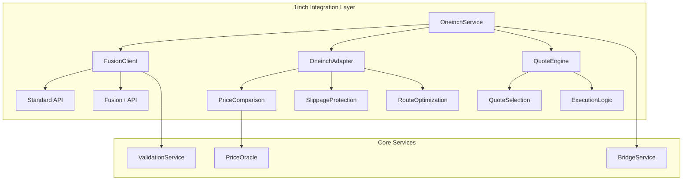
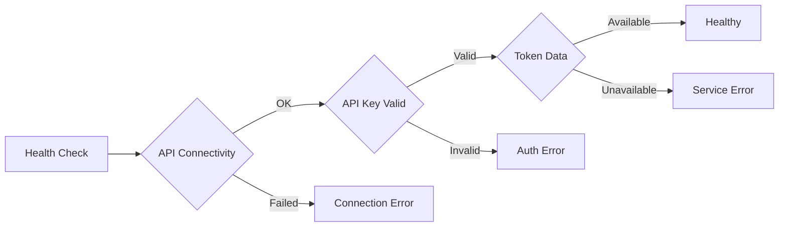

# 1inch Fusion+ Integration Module

## Overview

Complete integration with 1inch API and Fusion+ cross-chain swaps. Provides both single-chain and cross-chain trading capabilities with quantum-protected security.

## 🏗️ Architecture



## 🚀 Key Features

### Single-Chain Swaps
- Real-time quotes from 139+ liquidity sources
- Optimal route selection with gas optimization
- MEV protection and front-running resistance
- Advanced slippage protection

### Cross-Chain Swaps (Fusion+)
- Cross-chain quotes between supported networks
- Atomic order execution
- Secret management for partial fills
- Order monitoring and status tracking

### Security & Reliability
- Comprehensive API key validation
- No fallbacks - honest error reporting
- Extensive logging and monitoring
- Rate limiting and circuit breakers

## 📡 API Endpoints

### Quote Endpoints
- `GET /api/v1/swap/quote` - Get single-chain quote
- `GET /api/v1/swap/fusion-plus/quote` - Get cross-chain quote
- `GET /api/v1/swap/validate-api-key` - Validate 1inch API key

### Execution Endpoints
- `POST /api/v1/swap/execute` - Execute single-chain swap
- `POST /api/v1/swap/fusion-plus/build-order` - Build cross-chain order
- `POST /api/v1/swap/fusion-plus/submit-order` - Submit order to relayer

### Monitoring Endpoints
- `GET /api/v1/swap/health/comprehensive` - Complete health check
- `GET /api/v1/swap/liquidity/{token_a}/{token_b}` - Liquidity analysis
- `GET /api/v1/swap/orders/active` - Active cross-chain orders

## 🔧 Configuration

### Environment Variables
```bash
# Required
ONEINCH_API_KEY=your_production_api_key_here
ETHEREUM_CHAIN_ID=1

# Optional
ONEINCH_FUSION_TIMEOUT_SEC=30
ONEINCH_FUSION_MAX_RETRIES=3
ONEINCH_FUSION_RETRY_DELAY_MS=1000
```

### Supported Networks
- Ethereum (1)
- BSC (56) 
- Polygon (137)
- Avalanche (43114)
- Arbitrum (42161)
- Optimism (10)
- Sepolia Testnet (11155111)

## 💡 Usage Examples

### Basic Quote Request
```rust
let quote_params = QuoteParams {
    from_token: "0xEeeeeEeeeEeEeeEeEeEeeEEEeeeeEeeeeeeeEEeE", // ETH
    to_token: "0xA0b86a33E6441041946Ffc3e6ED01E73c23e632",   // USDC
    amount: BigDecimal::from(1000000000000000000u64), // 1 ETH
    from_address: wallet_address,
    slippage: Some(0.5),
    // ... other params
};

match oneinch_service.get_quote(&quote_params).await {
    Ok(quote) => println!("Quote: {} {}", quote.to_amount, quote.to_token.symbol),
    Err(e) => println!("Error: {}", e),
}
```

### Cross-Chain Quote
```rust
let fusion_request = FusionPlusQuoteRequest {
    src_chain: 1,    // Ethereum
    dst_chain: 137,  // Polygon
    src_token_address: "0xC02aaA39b223FE8D0A0e5C4F27eAD9083C756Cc2", // WETH
    dst_token_address: "0x2791Bca1f2de4661ED88A30C99A7a9449Aa84174", // USDC
    amount: "1000000000000000000".to_string(), // 1 ETH
    wallet_address: user_wallet,
    enable_estimate: true,
    // ... other params
};

let quote = fusion_client.get_cross_chain_quote(fusion_request).await?;
```

## 🔒 Security

### Honest Operation Principles
- **No fallbacks** - if API fails, return proper error
- **No mock data** - all responses from real 1inch API
- **Transparent errors** - detailed error reporting
- **API validation** - comprehensive key validation

### Error Handling
```rust
match result {
    Err(OneinchError::AuthenticationFailed) => {
        // Handle API key issues
    },
    Err(OneinchError::RateLimitExceeded) => {
        // Handle rate limiting
    },
    Err(OneinchError::ApiError { code, message }) => {
        // Handle API errors with details
    },
    _ => {}
}
```

## 📊 Monitoring

### Health Checks


### Performance Metrics
- Request latency tracking
- Success/failure rates
- API response times
- Cache hit ratios

## 🧪 Testing

### Unit Tests
```bash
cargo test oneinch
```

### Integration Tests
```bash
# Requires valid API key
cargo run --example oneinch_honest_integration
```

### API Testing
```bash
# Health check
curl http://localhost:4000/api/v1/swap/health/comprehensive

# Quote request
curl -X GET "http://localhost:4000/api/v1/swap/quote?from_token=ETH&to_token=USDC&amount=1000000000000000000"
```

## 📝 Development Guidelines

### SOLID Principles Implementation
- **Single Responsibility** - Each module handles one concern
- **Open/Closed** - Extensible architecture for new features
- **Liskov Substitution** - Interchangeable components
- **Interface Segregation** - Focused interfaces
- **Dependency Inversion** - Abstraction-based dependencies

### Code Quality
- Comprehensive error handling
- Extensive logging with context
- Performance monitoring
- Security-first approach

## 🚨 Important Notes

- This module requires a valid 1inch API key for production use
- All operations are logged for debugging and monitoring
- No fallback mechanisms - honest error reporting only
- Designed for production use with enterprise-grade reliability

## 📚 Further Reading

- [1inch Fusion+ Documentation](https://portal.1inch.dev/documentation/apis/swap/fusion-plus/introduction)
- [Bridge Integration Guide](../../docs/bridge-integration.md)
- [Security Best Practices](../../docs/security.md)