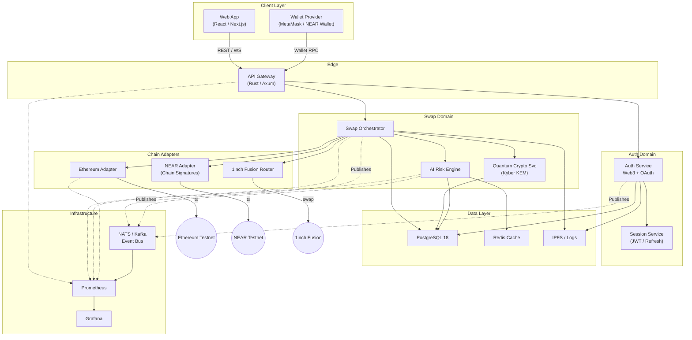

**Что показывает диаграмма**

1. **Client Layer** — веб-приложение и кошелек инициируют запросы к монолитному входу (API Gateway).
2. **Edge / API Gateway** маршрутизирует запросы к доменным микросервисам.
3. **Auth Domain** (Auth Service + Session Service) отвечает за все виды аутентификации; хранит сессии, публикует события в шину.
4. **Swap Domain** — ядро бизнес-логики:
   - **Swap Orchestrator** координирует операцию.
   - **Quantum Crypto Service** генерирует/хранит постквантовые ключи.
   - **AI Risk Engine** рассчитывает риски и кэширует признаки.
5. **Chain Adapters** изолируют работу с внешними сетями (Ethereum, NEAR, 1inch). Это позволяет независимо масштабировать и обновлять коннекторы.
6. **Data Layer** — централизованное хранилище (PostgreSQL 18), быстрый кэш (Redis) и распределённое хранилище логов/чекпоинтов (IPFS).
7. **Infrastructure** — общая событийная шина (NATS/Kafka) для слабой связанности сервисов и стек наблюдаемости (Prometheus + Grafana).

Такая модульность даёт:

- **Горизонтальное масштабирование** (каждый сервис можно дублировать).
- **Изоляцию зон ответственности** (безопасность, риск-менеджмент, блокчейн-адаптеры).
- **Гибкость развития**: легко добавлять новые цепи (добавив Adapter-сервис) или обновлять криптографию без влияния на остальные микросервисы.

### Ключевые отличия

|                             | **Твоя исходная диаграмма**                                                            | **Моя предложенная диаграмма**                                                                                                    |
| --------------------------- | -------------------------------------------------------------------------------------- | --------------------------------------------------------------------------------------------------------------------------------- |
| **Гранулярность**           | 4 крупных кластера (Gateway + Auth, Core Services, Blockchain Layer, Data/Monitoring). | Разбита на **6 доменов**: Edge, Auth Domain, Swap Domain, Chain Adapters, Data Layer, Infrastructure.                             |
| **Auth-слой**               | `AUTH` как подпроцесс внутри API-gateway.                                              | Выделен **Auth-домен** (Auth Svc + Session Svc) ⇒ проще заменить/масштабировать авторизацию без влияния на гейтвей.               |
| **Оркестрация свопа**       | `BRIDGE` напрямую общается с сетями.                                                   | Введён **Swap Orchestrator** + отдельные **Chain Adapters** → чёткая граница между бизнес-логикой и низкоуровневыми коннекторами. |
| **Шина событий**            | Нет. Компоненты связаны синхронно.                                                     | Добавлен **Event Bus (NATS/Kafka)** → слабая связанность, асинхронные уведомления, удобный расширяемый аудит/логирование.         |
| **Наблюдаемость**           | Prometheus/Grafana подключены напрямую к каждому сервису стрелкой.                     | Метрики тоже идут в Prometheus, но события дополнительно поступают из Event Bus → полный контекст (traces + events).              |
| **Модуль «Quantum Crypto»** | Есть (ML-KEM-1024), но его взаимодействие с другими сервисами implicit.                | `QC` отделён, вызывает БД напрямую и получает запросы только от Orchestrator → ограниченный контракт, проще тестировать.          |
| **AI Risk Engine**          | Присутствует, но без явной связи с кэшем и событиями.                                  | Указан обмен с Redis (кэш фич) и публикация событий → понятен поток данных и точка масштабирования ML-части.                      |
| **Ясность границ DDD**      | Смешаны concern’ы (Bridge = бизнес-логика + chain IO).                                 | Домены отражают **DDD-подход**: Auth, Swap, Chain IO, Observability – каждый со своей моделью.                                    |
| **Поддержка новых цепей**   | Нужно модифицировать `BRIDGE`.                                                         | Достаточно добавить новый **Adapter-сервис**.                                                                                     |
| **Сложность для хакатона**  | Минимальна – легко поднять Docker-compose.                                             | Чуть выше из-за Event Bus и доп. сервисов.                                                                                        |

### Что «лучше»?

| Сценарий                           | Какая схема предпочтительнее | Почему                                                                                                                                                                                       |
| ---------------------------------- | ---------------------------- | -------------------------------------------------------------------------------------------------------------------------------------------------------------------------------------------- |
| **Demo на хакатоне (2-3 недели)**  | **Исходная** (твоя)          | Меньше сервисов → быстрее разработать, проще деплой, меньше DevOps-нагрузка.                                                                                                                 |
| **Дальнейшая эволюция к MVP/Prod** | **Моя**                      | Готова к масштабированию: • легко добавлять новые блокчейны через адаптеры; • независимое масштабирование Auth, AI, Orchestrator; • Event Bus даёт надёжный аудит и реактивную безопасность. |
