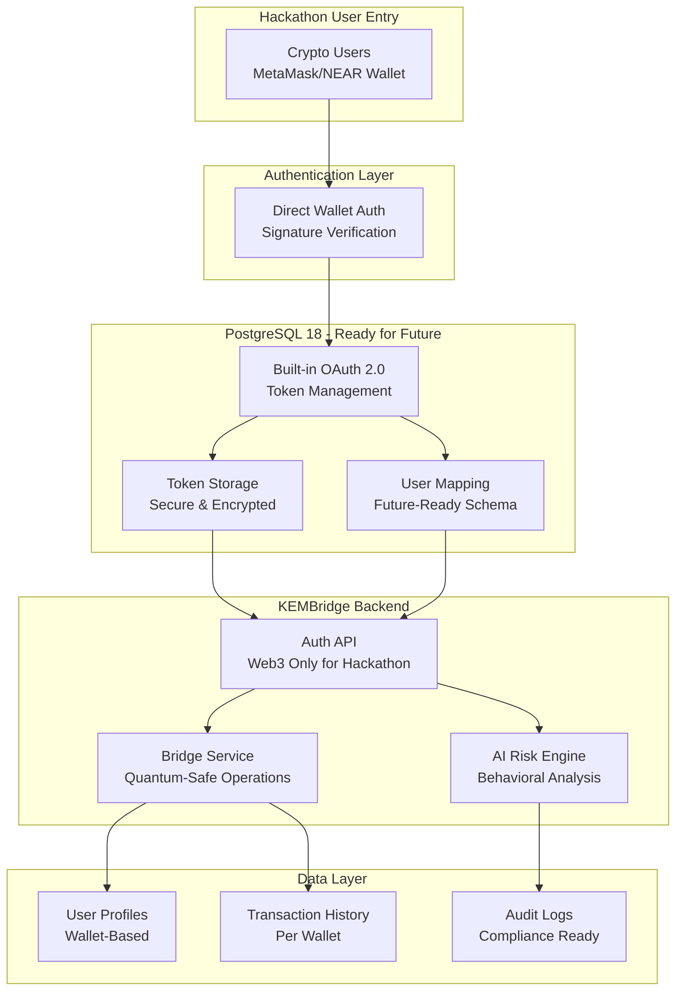
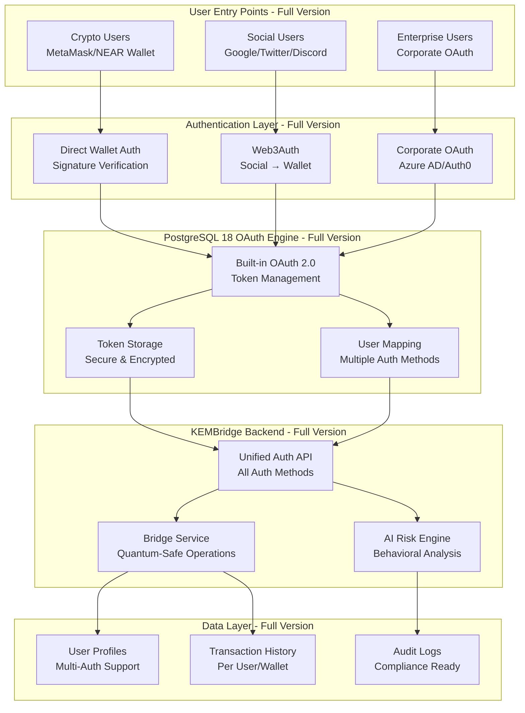
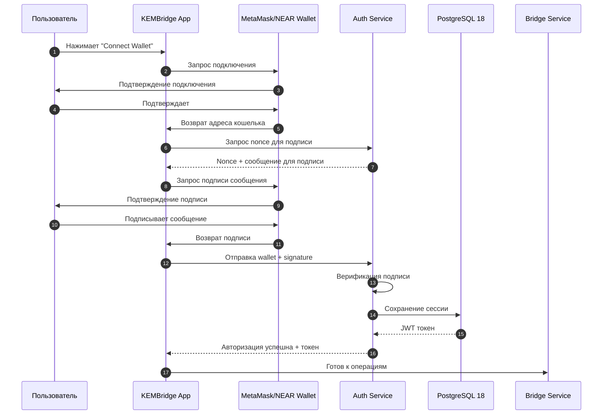
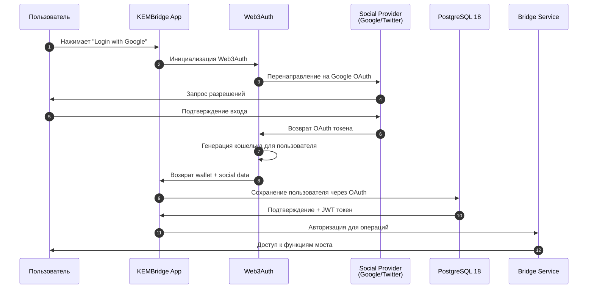
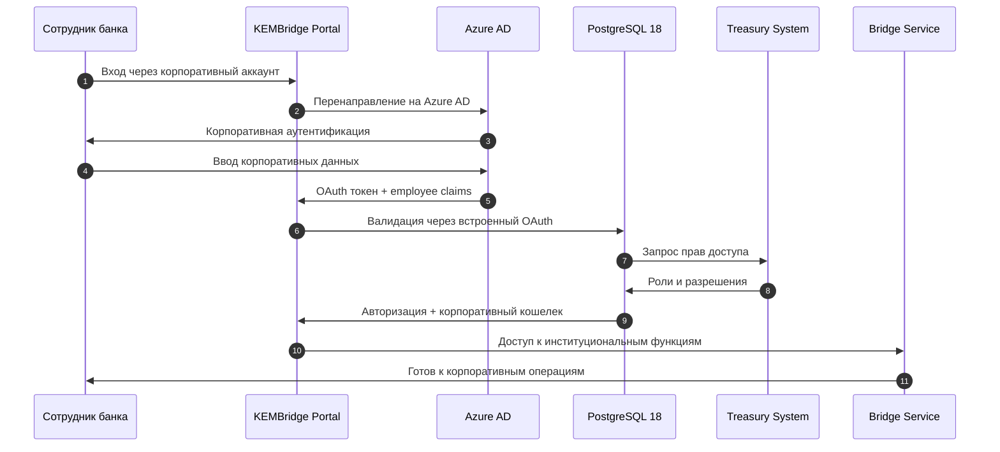

# OAuth Integration в KEMBridge

## Гибридная авторизация для Web3 и традиционных пользователей

KEMBridge реализует гибридную систему авторизации, которая сочетает традиционную Web3-авторизацию через кошельки с современными OAuth 2.0 стандартами. Это позволяет обслуживать как crypto-native пользователей, так и mainstream аудиторию.

## 🎯 Хакатон версия - только Web3 авторизация

**Для хакатона (2-3 недели) мы реализуем ТОЛЬКО прямую Web3-авторизацию через кошельки:**
- ✅ MetaMask
- ✅ NEAR Wallet
- ✅ WalletConnect
- ❌ Социальная авторизация (будущая версия)
- ❌ Корпоративная авторизация (будущая версия)

**База данных проектируется с учетом будущих возможностей**, но в хакатон версии используются только поля для Web3-авторизации.

## Архитектура для хакатона (упрощенная)



## Полная архитектура (будущие версии)



## Типы авторизации в KEMBridge

### 1. Прямая Web3 авторизация (🎯 ХАКАТОН - В РАЗРАБОТКЕ)

```typescript
interface DirectWalletAuth {
  provider: "metamask" | "walletconnect" | "near-wallet" | "phantom";
  address: string;
  signature: string;
  message: string;
  chainId: number;
}

// Пример реализации
class DirectWalletAuthService {
  async authenticateWallet(walletData: DirectWalletAuth): Promise<AuthResult> {
    // 1. Верифицируем подпись
    const isValidSignature = await this.verifySignature(
      walletData.message,
      walletData.signature,
      walletData.address
    );

    if (!isValidSignature) {
      throw new Error("Invalid wallet signature");
    }

    // 2. Создаем JWT токен
    const jwtToken = await this.generateJWT({
      walletAddress: walletData.address,
      provider: walletData.provider,
      chainId: walletData.chainId,
      authMethod: "direct_wallet",
    });

    // 3. Сохраняем сессию в PostgreSQL 18
    await this.saveSession(walletData.address, jwtToken);

    return {
      token: jwtToken,
      user: await this.getUserProfile(walletData.address),
      authMethod: "direct_wallet",
    };
  }
}
```

### 2. Социальная авторизация через Web3Auth (🚀 БУДУЩАЯ ВЕРСИЯ - MVP)

```typescript
interface SocialWalletAuth {
  provider: "google" | "twitter" | "discord" | "github";
  socialId: string;
  email?: string;
  name?: string;
  avatar?: string;
  walletAddress: string; // Генерируется Web3Auth
  web3AuthToken: string;
}

// Пример интеграции с Web3Auth
class SocialAuthService {
  async initializeWeb3Auth() {
    const web3auth = new Web3Auth({
      clientId: "KEMBridge_WEB3AUTH_CLIENT_ID",
      chainConfig: {
        chainNamespace: CHAIN_NAMESPACES.EIP155,
        chainId: "0x1", // Ethereum mainnet
        rpcTarget: "https://rpc.ankr.com/eth",
      },
      uiConfig: {
        theme: "dark",
        loginMethodsOrder: ["google", "twitter", "discord"],
        appLogo: "https://kembridge.io/logo.png",
      },
    });

    return web3auth;
  }

  async loginWithSocial(provider: string): Promise<SocialWalletAuth> {
    const web3auth = await this.initializeWeb3Auth();

    // Подключаемся через выбранный провайдер
    const web3authProvider = await web3auth.connectTo(provider);

    // Получаем информацию о пользователе
    const userInfo = await web3auth.getUserInfo();
    const walletAddress = await web3authProvider.getAddress();

    // Создаем профиль пользователя
    const socialAuth: SocialWalletAuth = {
      provider: provider as any,
      socialId: userInfo.verifierId,
      email: userInfo.email,
      name: userInfo.name,
      avatar: userInfo.profileImage,
      walletAddress: walletAddress,
      web3AuthToken: web3auth.token,
    };

    // Сохраняем в PostgreSQL 18 через OAuth
    await this.saveSocialUser(socialAuth);

    return socialAuth;
  }
}
```

### 3. Корпоративная авторизация (🏢 БУДУЩАЯ ВЕРСИЯ - PRODUCTION)

```sql
-- PostgreSQL 18 конфигурация для корпоративного OAuth
CREATE OAUTH_PROVIDER enterprise_bank (
  provider_name = 'JPMorgan Chase Corporate',
  provider_url = 'https://login.microsoftonline.com/jpmorgan-tenant-id',
  client_id = 'kembridge-enterprise-client',
  client_secret = 'encrypted_secret_key',
  scopes = 'openid profile wallet_access treasury_operations',
  redirect_uri = 'https://kembridge.io/auth/enterprise/callback',
  wallet_mapping_table = 'corporate_wallets',
  roles_mapping = '{
    "treasury_manager": ["bridge_operations", "large_transfers"],
    "trader": ["swap_operations", "liquidity_provision"],
    "compliance_officer": ["audit_access", "risk_review"]
  }'
);

-- Таблица для корпоративных пользователей
CREATE TABLE corporate_users (
  id UUID PRIMARY KEY,
  company_id UUID NOT NULL,
  employee_id VARCHAR(255) NOT NULL,
  oauth_provider VARCHAR(100) NOT NULL,
  oauth_subject_id VARCHAR(255) NOT NULL,
  corporate_wallet_address VARCHAR(255),
  personal_wallet_address VARCHAR(255),
  roles JSONB NOT NULL,
  permissions JSONB NOT NULL,
  created_at TIMESTAMP DEFAULT NOW(),
  last_login_at TIMESTAMP,
  UNIQUE(company_id, employee_id)
);
```

```typescript
// Корпоративная авторизация
interface EnterpriseAuth {
  companyId: string;
  employeeId: string;
  oauthProvider: string;
  corporateWallet: string;
  personalWallet?: string;
  roles: string[];
  permissions: string[];
}

class EnterpriseAuthService {
  async authenticateEmployee(oauthToken: string): Promise<EnterpriseAuth> {
    // 1. Валидируем OAuth токен через PostgreSQL 18
    const tokenValidation = await this.validateOAuthToken(oauthToken);

    if (!tokenValidation.valid) {
      throw new Error("Invalid OAuth token");
    }

    // 2. Получаем информацию о сотруднике
    const employeeInfo = await this.getEmployeeFromOAuth(
      tokenValidation.claims
    );

    // 3. Проверяем права доступа
    const permissions = await this.getEmployeePermissions(
      employeeInfo.companyId,
      employeeInfo.employeeId
    );

    // 4. Создаем корпоративную сессию
    const enterpriseAuth: EnterpriseAuth = {
      companyId: employeeInfo.companyId,
      employeeId: employeeInfo.employeeId,
      oauthProvider: tokenValidation.provider,
      corporateWallet: employeeInfo.corporateWallet,
      personalWallet: employeeInfo.personalWallet,
      roles: permissions.roles,
      permissions: permissions.permissions,
    };

    await this.saveEnterpriseSession(enterpriseAuth);

    return enterpriseAuth;
  }
}
```

## Последовательность авторизации

### Хакатон - Direct Wallet Auth Flow



### Web3Auth Social Login Flow (🚀 БУДУЩАЯ ВЕРСИЯ)



### Enterprise OAuth Flow (🏢 БУДУЩАЯ ВЕРСИЯ)



## Схема базы данных (готова для будущих версий)

**Для хакатона используются только:**
- ✅ `users` - базовая информация о пользователях
- ✅ `user_auth_methods` - только `auth_type = 'direct_wallet'`
- ✅ `user_sessions` - JWT токены для Web3 авторизации
- ❌ `corporate_users` - не используется в хакатоне

**Полная схема готова для будущих версий:**

```sql
-- Универсальная таблица пользователей
CREATE TABLE users (
  id UUID PRIMARY KEY,

  -- Основная информация
  email VARCHAR(255),
  name VARCHAR(255),
  avatar_url VARCHAR(500),

  -- Статус и метаданные
  status VARCHAR(50) DEFAULT 'active',
  user_type VARCHAR(50) DEFAULT 'individual', -- individual, corporate, enterprise
  kyc_status VARCHAR(50) DEFAULT 'pending',

  -- Временные метки
  created_at TIMESTAMP DEFAULT NOW(),
  updated_at TIMESTAMP DEFAULT NOW(),
  last_login_at TIMESTAMP,

  -- Поля для поиска
  search_vector tsvector
);

-- Таблица методов авторизации (один пользователь может иметь несколько)
CREATE TABLE user_auth_methods (
  id UUID PRIMARY KEY,
  user_id UUID NOT NULL REFERENCES users(id),

  -- Тип авторизации
  auth_type VARCHAR(50) NOT NULL, -- direct_wallet, social_oauth, enterprise_oauth
  auth_provider VARCHAR(100), -- metamask, web3auth_google, azure_ad, etc.

  -- Идентификаторы
  external_id VARCHAR(255), -- wallet address, social ID, employee ID
  oauth_subject_id VARCHAR(255), -- для OAuth провайдеров

  -- Данные аутентификации
  wallet_address VARCHAR(255),
  public_key TEXT,
  oauth_refresh_token TEXT, -- зашифрованный

  -- Метаданные
  provider_metadata JSONB,
  last_used_at TIMESTAMP,
  is_primary BOOLEAN DEFAULT FALSE,

  created_at TIMESTAMP DEFAULT NOW(),

  -- Один пользователь может иметь только один primary метод каждого типа
  UNIQUE(user_id, auth_type, is_primary) WHERE is_primary = TRUE
);

-- Таблица сессий с OAuth поддержкой
CREATE TABLE user_sessions (
  id UUID PRIMARY KEY,
  user_id UUID NOT NULL REFERENCES users(id),
  auth_method_id UUID NOT NULL REFERENCES user_auth_methods(id),

  -- Токены
  jwt_token TEXT NOT NULL,
  oauth_access_token TEXT, -- зашифрованный
  oauth_refresh_token TEXT, -- зашифрованный

  -- Метаданные сессии
  ip_address INET,
  user_agent TEXT,
  device_fingerprint VARCHAR(255),

  -- Время жизни
  created_at TIMESTAMP DEFAULT NOW(),
  expires_at TIMESTAMP NOT NULL,
  last_activity_at TIMESTAMP DEFAULT NOW(),

  -- Статус
  is_active BOOLEAN DEFAULT TRUE,
  revoked_at TIMESTAMP,
  revoked_reason VARCHAR(255)
);

-- Таблица для корпоративных пользователей
CREATE TABLE corporate_users (
  id UUID PRIMARY KEY,
  user_id UUID NOT NULL REFERENCES users(id),

  -- Корпоративная информация
  company_id UUID NOT NULL,
  company_name VARCHAR(255) NOT NULL,
  employee_id VARCHAR(255) NOT NULL,
  department VARCHAR(255),

  -- Корпоративные кошельки
  corporate_wallet_address VARCHAR(255),
  treasury_wallet_address VARCHAR(255),

  -- Роли и разрешения
  roles JSONB NOT NULL DEFAULT '[]',
  permissions JSONB NOT NULL DEFAULT '{}',

  -- Лимиты
  daily_limit_usd DECIMAL(20,2),
  monthly_limit_usd DECIMAL(20,2),
  single_tx_limit_usd DECIMAL(20,2),

  created_at TIMESTAMP DEFAULT NOW(),
  updated_at TIMESTAMP DEFAULT NOW(),

  UNIQUE(company_id, employee_id)
);

-- Индексы для производительности
CREATE INDEX idx_users_email ON users(email);
CREATE INDEX idx_users_search ON users USING gin(search_vector);
CREATE INDEX idx_auth_methods_user ON user_auth_methods(user_id);
CREATE INDEX idx_auth_methods_external ON user_auth_methods(external_id);
CREATE INDEX idx_auth_methods_wallet ON user_auth_methods(wallet_address);
CREATE INDEX idx_sessions_user ON user_sessions(user_id);
CREATE INDEX idx_sessions_active ON user_sessions(is_active, expires_at);
CREATE INDEX idx_corporate_company ON corporate_users(company_id);
```

## Конфигурация OAuth провайдеров

```typescript
// Конфигурация для различных OAuth провайдеров
interface OAuthConfig {
  web3auth: {
    clientId: string;
    chainConfig: {
      chainNamespace: string;
      chainId: string;
      rpcTarget: string;
    };
    uiConfig: {
      theme: "light" | "dark";
      loginMethodsOrder: string[];
      appLogo: string;
    };
  };

  enterprise: {
    [companyId: string]: {
      providerName: string;
      providerUrl: string;
      clientId: string;
      clientSecret: string;
      scopes: string[];
      redirectUri: string;
      walletMapping: string;
      rolesMapping: Record<string, string[]>;
    };
  };
}

// Пример конфигурации
const oauthConfig: OAuthConfig = {
  web3auth: {
    clientId:
      "BHloyoNB0q6GDDtw7m8kTqtqVJmvb_dGVQb_-BbNLZWlk7x8l9GKQfhHzJv0rKzW",
    chainConfig: {
      chainNamespace: "eip155",
      chainId: "0x1",
      rpcTarget: "https://rpc.ankr.com/eth",
    },
    uiConfig: {
      theme: "dark",
      loginMethodsOrder: ["google", "twitter", "discord", "github"],
      appLogo: "https://kembridge.io/logo.png",
    },
  },

  enterprise: {
    "jpmorgan-chase": {
      providerName: "JPMorgan Chase Corporate",
      providerUrl: "https://login.microsoftonline.com/jpmorgan-tenant-id",
      clientId: "kembridge-jpmorgan-client",
      clientSecret: "encrypted_secret_key",
      scopes: ["openid", "profile", "wallet_access", "treasury_operations"],
      redirectUri: "https://kembridge.io/auth/enterprise/jpmorgan/callback",
      walletMapping: "jpmorgan_corporate_wallets",
      rolesMapping: {
        treasury_manager: [
          "bridge_operations",
          "large_transfers",
          "risk_override",
        ],
        trader: ["swap_operations", "liquidity_provision"],
        compliance_officer: [
          "audit_access",
          "risk_review",
          "transaction_monitoring",
        ],
      },
    },
  },
};
```

## Middleware для авторизации

```typescript
// Универсальный middleware для проверки авторизации
class AuthMiddleware {
  async verifyToken(req: Request, res: Response, next: NextFunction) {
    try {
      const token = this.extractToken(req);

      if (!token) {
        return res.status(401).json({ error: "No token provided" });
      }

      // Проверяем токен через PostgreSQL 18
      const session = await this.validateSession(token);

      if (!session || !session.is_active) {
        return res.status(401).json({ error: "Invalid or expired token" });
      }

      // Загружаем полный профиль пользователя
      const userProfile = await this.loadUserProfile(session.user_id);

      // Добавляем в request
      req.user = userProfile;
      req.session = session;

      next();
    } catch (error) {
      return res.status(401).json({ error: "Authentication failed" });
    }
  }

  // Middleware для проверки конкретных разрешений
  requirePermission(permission: string) {
    return async (req: Request, res: Response, next: NextFunction) => {
      if (!req.user) {
        return res.status(401).json({ error: "Authentication required" });
      }

      const hasPermission = await this.checkPermission(req.user.id, permission);

      if (!hasPermission) {
        return res.status(403).json({ error: "Insufficient permissions" });
      }

      next();
    };
  }

  // Middleware для корпоративных операций
  requireCorporateAccess(minimumRole?: string) {
    return async (req: Request, res: Response, next: NextFunction) => {
      if (!req.user || req.user.user_type !== "corporate") {
        return res.status(403).json({ error: "Corporate access required" });
      }

      if (minimumRole) {
        const hasRole = await this.checkCorporateRole(req.user.id, minimumRole);
        if (!hasRole) {
          return res
            .status(403)
            .json({ error: `Role ${minimumRole} required` });
        }
      }

      next();
    };
  }
}
```

## Использование в API endpoints

```typescript
// Пример использования в Express.js приложении
const app = express();
const auth = new AuthMiddleware();

// Публичные endpoints
app.post("/api/auth/wallet", authController.authenticateWallet);
app.post("/api/auth/social", authController.authenticateSocial);
app.post("/api/auth/enterprise", authController.authenticateEnterprise);

// Защищенные endpoints
app.get("/api/user/profile", auth.verifyToken, userController.getProfile);

app.post(
  "/api/bridge/swap",
  auth.verifyToken,
  auth.requirePermission("swap_operations"),
  bridgeController.createSwap
);

// Корпоративные endpoints
app.post(
  "/api/corporate/large-transfer",
  auth.verifyToken,
  auth.requireCorporateAccess("treasury_manager"),
  corporateController.createLargeTransfer
);

app.get(
  "/api/corporate/audit-logs",
  auth.verifyToken,
  auth.requireCorporateAccess("compliance_officer"),
  auditController.getAuditLogs
);
```

## Заключение

Гибридная OAuth система KEMBridge обеспечивает:

1. **Гибкость** - Поддержка множественных методов авторизации
2. **Безопасность** - Встроенная поддержка OAuth 2.0 в PostgreSQL 18
3. **Масштабируемость** - От индивидуальных пользователей до корпоративных клиентов
4. **Соответствие стандартам** - Полная совместимость с OAuth 2.0 и OpenID Connect
5. **Простота интеграции** - Единый API для всех типов авторизации

Эта архитектура позволяет KEMBridge обслуживать широкий спектр пользователей - от crypto-энтузиастов до крупных финансовых институтов, сохраняя при этом высокий уровень безопасности и удобства использования.
