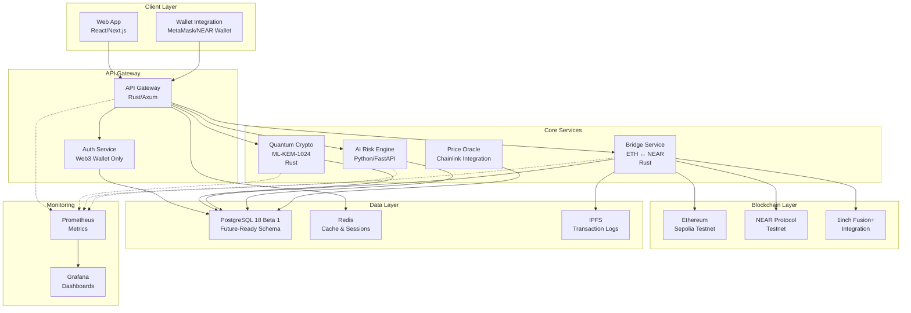
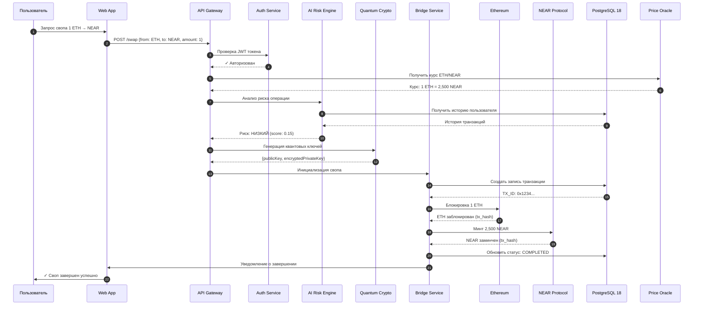
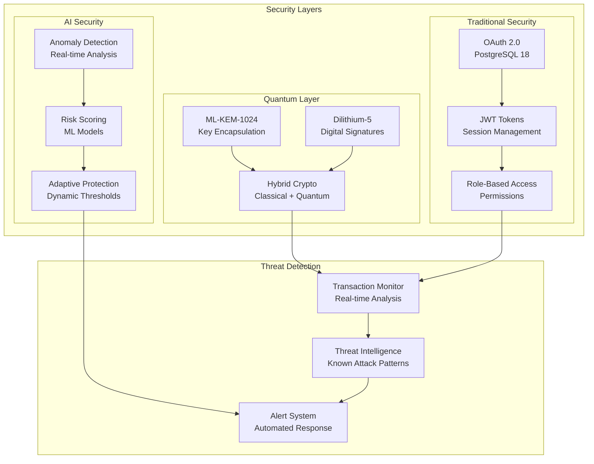
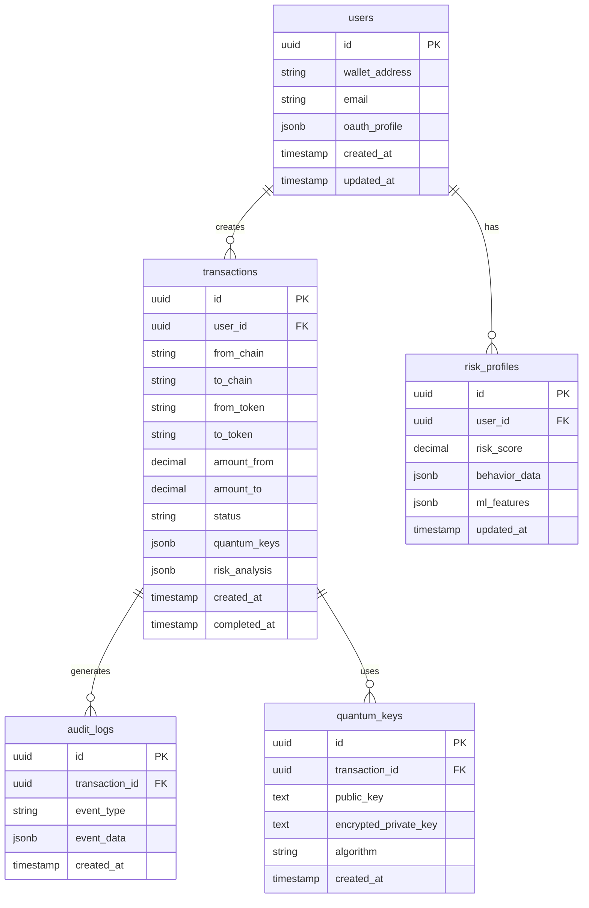
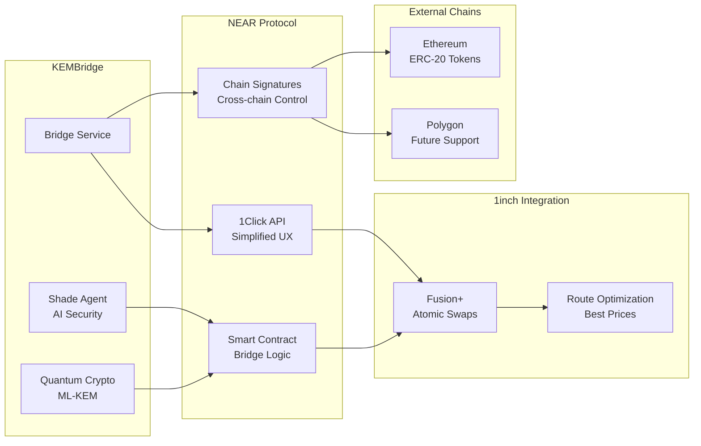
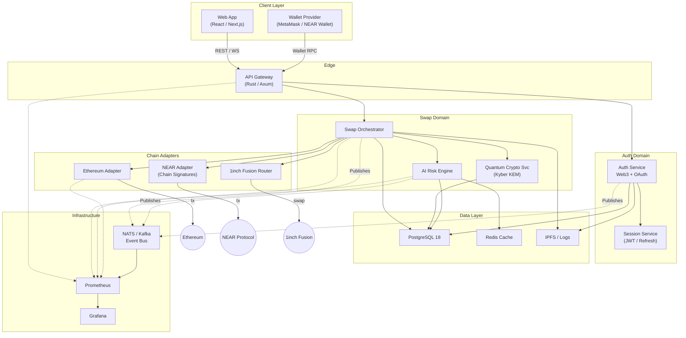
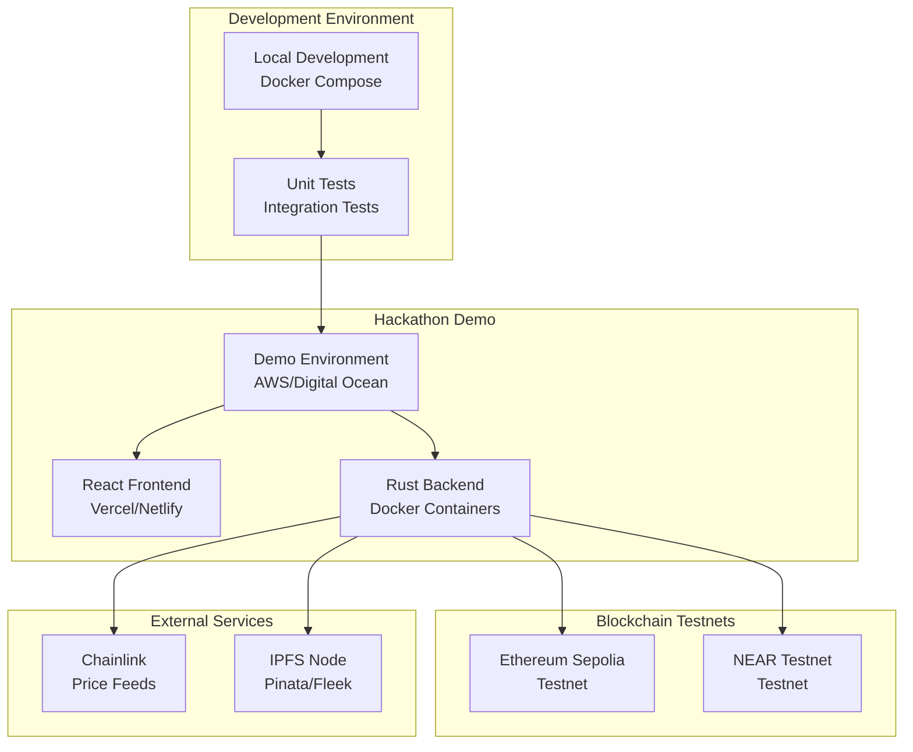

# KEMBridge Technical Architecture

## Техническая архитектура и диаграммы

Данный документ содержит детальные архитектурные схемы для KEMBridge — квантово-устойчивого кросс-чейн моста. Представленные диаграммы отражают архитектуру для хакатон версии проекта (2-3 недели разработки).

## 🎯 Хакатон версия - упрощенная архитектура

**Авторизация:** Только Web3 кошельки (MetaMask, NEAR Wallet, WalletConnect)
**Блокчейны:** Ethereum ↔ NEAR Protocol
**База данных:** PostgreSQL 18 Beta 1 (готова для будущих версий)
**Криптография:** Базовый ML-KEM-1024 для демонстрации

### Выбор архитектуры для хакатона

Для демонстрации на хакатоне выбрана **упрощенная архитектура** с минимальным количеством сервисов. После хакатона планируется миграция к **полноценной микросервисной архитектуре** с Event Bus и доменным разделением.

## Архитектура микросервисов для хакатона

## Последовательность операций кросс-чейн свопа

## Архитектура безопасности

## База данных - PostgreSQL 18 Beta 1

## Интеграция с Near Protocol

## Будущая микросервисная архитектура (Post-Hackathon)

После успешной демонстрации на хакатоне планируется миграция к полноценной микросервисной архитектуре:

### Преимущества микросервисной архитектуры:

**🚀 Масштабируемость:**
- Независимое масштабирование каждого домена
- Event Bus для асинхронной обработки
- Горизонтальное масштабирование адаптеров

**🔧 Гибкость разработки:**
- Четкие границы доменов (Auth, Swap, Chain IO)
- Простое добавление новых блокчейнов
- Независимые команды разработки

**🛡️ Надежность:**
- Изоляция сбоев
- Circuit breakers между сервисами
- Распределенный мониторинг

## Развертывание для хакатона

## Особенности PostgreSQL 18 Beta 1

В хакатон версии KEMBridge планируется использовать **PostgreSQL 18 Beta 1** с нативной поддержкой **OAuth 2.0**. Это стратегическое решение основано на том, что к моменту production релиза KEMBridge PostgreSQL 18 будет иметь стабильную версию.

**Преимущества PostgreSQL 18 для KEMBridge:**

1. **Встроенная OAuth 2.0 поддержка** - упрощает интеграцию с Web3Auth и другими OAuth провайдерами
2. **Улучшенная производительность JSON/JSONB** - критично для хранения квантовых ключей и метаданных транзакций
3. **Расширенные возможности аудита** - встроенные механизмы для compliance и безопасности
4. **Лучшая поддержка шифрования** - совместимость с постквантовыми алгоритмами

**Применение в KEMBridge:**
- Аутентификация пользователей через OAuth 2.0
- Хранение зашифрованных квантовых ключей
- Журналирование всех операций для аудита
- Интеграция с AI/ML системами для анализа рисков