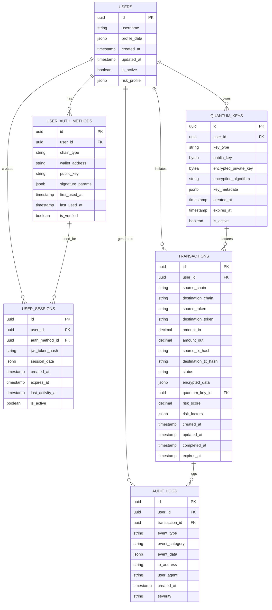

# KEMBridge Database Schema & Migrations

## 📋 Overview

Детальное руководство по созданию схемы базы данных и миграций для KEMBridge. Включает анализ требований к данным, проектирование схемы и пошаговую реализацию всех необходимых таблиц с учетом специфики кросс-чейн моста и постквантовой криптографии.

## 🔍 Database Requirements Analysis

### Специфические требования KEMBridge

#### Безопасность и аудит
**Критически важные аспекты:**
- ✅ **Полный аудит**: Все финансовые операции должны логироваться
- ✅ **Постквантовые ключи**: Безопасное хранение ML-KEM-1024 ключей
- ✅ **Целостность данных**: Невозможность удаления критических записей
- ✅ **Временные метки**: UTC timestamps для всех операций
- ✅ **Шифрование**: Чувствительные данные шифруются на уровне приложения

#### Web3 Authentication
**Требования к авторизации:**
- 🔐 **Множественные кошельки**: Один пользователь может иметь несколько кошельков
- 🔐 **Мультичейн поддержка**: Ethereum (secp256k1) и NEAR (ed25519) подписи
- 🔐 **Session management**: JWT токены с возможностью ротации
- 🔐 **Nonce tracking**: Предотвращение replay attacks

#### Cross-chain Transactions
**Сложность кросс-чейн операций:**
- ⛓️ **Атомарность**: Транзакции либо выполняются полностью, либо откатываются
- ⛓️ **Состояния**: Множественные состояния транзакции (pending, locked, confirmed, failed)
- ⛓️ **Временные ограничения**: Timeouts для предотвращения зависших транзакций
- ⛓️ **Rollback механизм**: Возможность отката при сбоях

#### AI Risk Analysis
**Машинное обучение и анализ рисков:**
- 🧠 **Профили пользователей**: Накопление данных о поведении пользователей
- 🧠 **Risk scoring**: Динамические риск-скоры в реальном времени
- 🧠 **Паттерны поведения**: Анализ частоты, размеров и времени операций
- 🧠 **Blacklists**: Динамические списки подозрительных адресов

### PostgreSQL 18 Beta 1 Advantages

#### Новые возможности для KEMBridge
**Специфические преимущества:**
- ✅ **OAuth 2.0 поддержка**: Встроенная поддержка OAuth для будущих интеграций
- ✅ **Улучшенный JSONB**: Лучшая производительность для хранения квантовых ключей
- ✅ **Enhanced Audit**: Новые возможности аудита для compliance
- ✅ **Performance improvements**: Оптимизированные индексы для time-series данных
- ✅ **Безопасность**: Улучшенное шифрование для sensitive data

#### SQL Extensions для KEMBridge
```sql
-- Включение необходимых расширений
CREATE EXTENSION IF NOT EXISTS "uuid-ossp";    -- UUID generation
CREATE EXTENSION IF NOT EXISTS "pg_crypto";    -- Encryption functions
CREATE EXTENSION IF NOT EXISTS "btree_gin";    -- GIN indexes for better performance
CREATE EXTENSION IF NOT EXISTS "pg_trgm";      -- Text search optimization
```

## 🏗️ Database Schema Design

### Schema Overview


### Core Tables Design

#### 1. Users Table - Основные пользователи
```sql
-- Централизованное хранение пользователей с поддержкой множественных кошельков
CREATE TABLE users (
    id UUID PRIMARY KEY DEFAULT uuid_generate_v4(),
    username VARCHAR(255) UNIQUE,  -- Optional readable name
    profile_data JSONB DEFAULT '{}',  -- Flexible user metadata
    created_at TIMESTAMP WITH TIME ZONE DEFAULT NOW(),
    updated_at TIMESTAMP WITH TIME ZONE DEFAULT NOW(),
    is_active BOOLEAN DEFAULT true,
    risk_profile JSONB DEFAULT '{}',  -- AI-generated risk profile
    
    -- Constraints
    CONSTRAINT users_username_length CHECK (char_length(username) >= 3),
    CONSTRAINT users_profile_is_object CHECK (jsonb_typeof(profile_data) = 'object'),
    CONSTRAINT users_risk_profile_is_object CHECK (jsonb_typeof(risk_profile) = 'object')
);

-- Performance indexes
CREATE INDEX idx_users_username ON users(username) WHERE username IS NOT NULL;
CREATE INDEX idx_users_created_at ON users(created_at);
CREATE INDEX idx_users_is_active ON users(is_active) WHERE is_active = true;
CREATE INDEX idx_users_risk_profile_gin ON users USING GIN (risk_profile);

-- Audit trigger setup
CREATE TRIGGER users_update_timestamp 
    BEFORE UPDATE ON users 
    FOR EACH ROW 
    EXECUTE FUNCTION update_timestamp();
```

#### 2. User Auth Methods - Web3 кошельки
```sql
-- Хранение всех методов авторизации пользователя (Ethereum, NEAR, etc)
CREATE TABLE user_auth_methods (
    id UUID PRIMARY KEY DEFAULT uuid_generate_v4(),
    user_id UUID NOT NULL REFERENCES users(id) ON DELETE CASCADE,
    chain_type VARCHAR(50) NOT NULL,  -- 'ethereum', 'near', etc
    wallet_address VARCHAR(255) NOT NULL,  -- Blockchain address
    public_key TEXT,  -- For signature verification
    signature_params JSONB DEFAULT '{}',  -- Chain-specific parameters
    first_used_at TIMESTAMP WITH TIME ZONE DEFAULT NOW(),
    last_used_at TIMESTAMP WITH TIME ZONE DEFAULT NOW(),
    is_verified BOOLEAN DEFAULT false,
    
    -- Constraints
    CONSTRAINT auth_methods_chain_type_valid 
        CHECK (chain_type IN ('ethereum', 'near')),
    CONSTRAINT auth_methods_wallet_address_format 
        CHECK (
            (chain_type = 'ethereum' AND wallet_address ~ '^0x[a-fA-F0-9]{40}$') OR
            (chain_type = 'near' AND char_length(wallet_address) > 2)
        ),
    CONSTRAINT auth_methods_unique_wallet 
        UNIQUE (chain_type, wallet_address)
);

-- Performance indexes
CREATE INDEX idx_auth_methods_user_id ON user_auth_methods(user_id);
CREATE INDEX idx_auth_methods_wallet_lookup ON user_auth_methods(chain_type, wallet_address);
CREATE INDEX idx_auth_methods_verified ON user_auth_methods(is_verified) WHERE is_verified = true;
CREATE INDEX idx_auth_methods_last_used ON user_auth_methods(last_used_at);

-- Audit trigger
CREATE TRIGGER auth_methods_update_last_used 
    BEFORE UPDATE ON user_auth_methods 
    FOR EACH ROW 
    EXECUTE FUNCTION update_last_used_timestamp();
```

#### 3. User Sessions - JWT управление
```sql
-- Активные пользовательские сессии с JWT токенами
CREATE TABLE user_sessions (
    id UUID PRIMARY KEY DEFAULT uuid_generate_v4(),
    user_id UUID NOT NULL REFERENCES users(id) ON DELETE CASCADE,
    auth_method_id UUID NOT NULL REFERENCES user_auth_methods(id) ON DELETE CASCADE,
    jwt_token_hash VARCHAR(255) NOT NULL UNIQUE,  -- SHA-256 hash of JWT
    session_data JSONB DEFAULT '{}',  -- Additional session metadata
    created_at TIMESTAMP WITH TIME ZONE DEFAULT NOW(),
    expires_at TIMESTAMP WITH TIME ZONE NOT NULL,
    last_activity_at TIMESTAMP WITH TIME ZONE DEFAULT NOW(),
    is_active BOOLEAN DEFAULT true,
    
    -- Constraints
    CONSTRAINT sessions_expires_after_created 
        CHECK (expires_at > created_at),
    CONSTRAINT sessions_token_hash_format 
        CHECK (char_length(jwt_token_hash) = 64),  -- SHA-256 hash length
    CONSTRAINT sessions_data_is_object 
        CHECK (jsonb_typeof(session_data) = 'object')
);

-- Performance indexes
CREATE INDEX idx_sessions_user_id ON user_sessions(user_id);
CREATE INDEX idx_sessions_token_hash ON user_sessions(jwt_token_hash);
CREATE INDEX idx_sessions_active ON user_sessions(is_active, expires_at) WHERE is_active = true;
CREATE INDEX idx_sessions_cleanup ON user_sessions(expires_at) WHERE is_active = false;

-- Automatic cleanup of expired sessions
CREATE OR REPLACE FUNCTION cleanup_expired_sessions()
RETURNS void AS $$
BEGIN
    UPDATE user_sessions 
    SET is_active = false 
    WHERE expires_at < NOW() AND is_active = true;
END;
$$ LANGUAGE plpgsql;
```

#### 4. Transactions - Кросс-чейн операции
```sql
-- Основная таблица для всех кросс-чейн транзакций
CREATE TABLE transactions (
    id UUID PRIMARY KEY DEFAULT uuid_generate_v4(),
    user_id UUID NOT NULL REFERENCES users(id),
    
    -- Cross-chain details
    source_chain VARCHAR(50) NOT NULL,
    destination_chain VARCHAR(50) NOT NULL,
    source_token VARCHAR(100) NOT NULL,
    destination_token VARCHAR(100) NOT NULL,
    amount_in DECIMAL(36, 18) NOT NULL,  -- Support for very large/small amounts
    amount_out DECIMAL(36, 18),
    
    -- Blockchain transaction hashes
    source_tx_hash VARCHAR(255),
    destination_tx_hash VARCHAR(255),
    
    -- Transaction state management
    status VARCHAR(50) NOT NULL DEFAULT 'pending',
    
    -- Quantum cryptography integration
    encrypted_data BYTEA,  -- Encrypted transaction details
    quantum_key_id UUID REFERENCES quantum_keys(id),
    
    -- AI Risk analysis
    risk_score DECIMAL(5, 4) DEFAULT 0.0000,  -- 0.0000 to 1.0000
    risk_factors JSONB DEFAULT '{}',
    
    -- Timestamps
    created_at TIMESTAMP WITH TIME ZONE DEFAULT NOW(),
    updated_at TIMESTAMP WITH TIME ZONE DEFAULT NOW(),
    completed_at TIMESTAMP WITH TIME ZONE,
    expires_at TIMESTAMP WITH TIME ZONE,
    
    -- Constraints
    CONSTRAINT transactions_valid_chains 
        CHECK (source_chain IN ('ethereum', 'near') AND destination_chain IN ('ethereum', 'near')),
    CONSTRAINT transactions_different_chains 
        CHECK (source_chain != destination_chain),
    CONSTRAINT transactions_positive_amounts 
        CHECK (amount_in > 0 AND (amount_out IS NULL OR amount_out > 0)),
    CONSTRAINT transactions_valid_status 
        CHECK (status IN ('pending', 'locked', 'confirmed', 'failed', 'cancelled', 'expired')),
    CONSTRAINT transactions_risk_score_range 
        CHECK (risk_score >= 0.0000 AND risk_score <= 1.0000),
    CONSTRAINT transactions_completion_logic 
        CHECK (
            (status IN ('confirmed', 'failed', 'cancelled') AND completed_at IS NOT NULL) OR
            (status NOT IN ('confirmed', 'failed', 'cancelled') AND completed_at IS NULL)
        )
);

-- Performance indexes for high-frequency queries
CREATE INDEX idx_transactions_user_id ON transactions(user_id);
CREATE INDEX idx_transactions_status ON transactions(status);
CREATE INDEX idx_transactions_created_at ON transactions(created_at);
CREATE INDEX idx_transactions_source_tx_hash ON transactions(source_tx_hash) WHERE source_tx_hash IS NOT NULL;
CREATE INDEX idx_transactions_destination_tx_hash ON transactions(destination_tx_hash) WHERE destination_tx_hash IS NOT NULL;
CREATE INDEX idx_transactions_risk_score ON transactions(risk_score) WHERE risk_score > 0.5;
CREATE INDEX idx_transactions_pending_expired ON transactions(status, expires_at) 
    WHERE status = 'pending' AND expires_at IS NOT NULL;

-- GIN index for risk factors analysis
CREATE INDEX idx_transactions_risk_factors_gin ON transactions USING GIN (risk_factors);

-- Composite indexes for complex queries
CREATE INDEX idx_transactions_user_status_created ON transactions(user_id, status, created_at);
CREATE INDEX idx_transactions_chains_status ON transactions(source_chain, destination_chain, status);
```

#### 5. Quantum Keys - Постквантовые ключи
```sql
-- Хранение постквантовых ключей (ML-KEM-1024 и других)
CREATE TABLE quantum_keys (
    id UUID PRIMARY KEY DEFAULT uuid_generate_v4(),
    user_id UUID NOT NULL REFERENCES users(id) ON DELETE CASCADE,
    
    -- Key type and algorithm information
    key_type VARCHAR(50) NOT NULL DEFAULT 'ml-kem-1024',
    public_key BYTEA NOT NULL,  -- Raw public key bytes
    encrypted_private_key BYTEA NOT NULL,  -- AES-GCM encrypted private key
    encryption_algorithm VARCHAR(100) NOT NULL DEFAULT 'aes-256-gcm',
    
    -- Key metadata and lifecycle
    key_metadata JSONB DEFAULT '{}',  -- Algorithm parameters, etc.
    created_at TIMESTAMP WITH TIME ZONE DEFAULT NOW(),
    expires_at TIMESTAMP WITH TIME ZONE,  -- Key rotation support
    is_active BOOLEAN DEFAULT true,
    
    -- Constraints
    CONSTRAINT quantum_keys_valid_type 
        CHECK (key_type IN ('ml-kem-1024', 'dilithium-5', 'sphincs+')),
    CONSTRAINT quantum_keys_valid_encryption 
        CHECK (encryption_algorithm IN ('aes-256-gcm', 'chacha20-poly1305')),
    CONSTRAINT quantum_keys_key_sizes 
        CHECK (
            (key_type = 'ml-kem-1024' AND octet_length(public_key) = 1568) OR
            (key_type != 'ml-kem-1024')  -- Other algorithms have different sizes
        ),
    CONSTRAINT quantum_keys_metadata_is_object 
        CHECK (jsonb_typeof(key_metadata) = 'object'),
    CONSTRAINT quantum_keys_expiry_logic 
        CHECK (expires_at IS NULL OR expires_at > created_at)
);

-- Security and performance indexes
CREATE INDEX idx_quantum_keys_user_id ON quantum_keys(user_id);
CREATE INDEX idx_quantum_keys_active ON quantum_keys(is_active, expires_at) WHERE is_active = true;
CREATE INDEX idx_quantum_keys_type ON quantum_keys(key_type);
CREATE INDEX idx_quantum_keys_expiry ON quantum_keys(expires_at) WHERE expires_at IS NOT NULL;

-- Metadata search index
CREATE INDEX idx_quantum_keys_metadata_gin ON quantum_keys USING GIN (key_metadata);
```

#### 6. Audit Logs - Полный аудит системы
```sql
-- Comprehensive audit logging for all system events
CREATE TABLE audit_logs (
    id UUID PRIMARY KEY DEFAULT uuid_generate_v4(),
    user_id UUID REFERENCES users(id),  -- Nullable for system events
    transaction_id UUID REFERENCES transactions(id),  -- Link to transaction if applicable
    
    -- Event classification
    event_type VARCHAR(100) NOT NULL,  -- 'login', 'transaction', 'key_generation', etc.
    event_category VARCHAR(50) NOT NULL,  -- 'auth', 'finance', 'security', 'system'
    event_data JSONB NOT NULL DEFAULT '{}',  -- Detailed event information
    
    -- Security context
    ip_address INET,  -- User IP address
    user_agent TEXT,  -- Browser/client information
    
    -- Timestamp and severity
    created_at TIMESTAMP WITH TIME ZONE DEFAULT NOW(),
    severity VARCHAR(20) DEFAULT 'info',  -- 'info', 'warning', 'error', 'critical'
    
    -- Constraints
    CONSTRAINT audit_logs_valid_category 
        CHECK (event_category IN ('auth', 'finance', 'security', 'system', 'admin')),
    CONSTRAINT audit_logs_valid_severity 
        CHECK (severity IN ('debug', 'info', 'warning', 'error', 'critical')),
    CONSTRAINT audit_logs_event_data_is_object 
        CHECK (jsonb_typeof(event_data) = 'object')
);

-- High-performance indexes for audit queries
CREATE INDEX idx_audit_logs_user_id ON audit_logs(user_id) WHERE user_id IS NOT NULL;
CREATE INDEX idx_audit_logs_transaction_id ON audit_logs(transaction_id) WHERE transaction_id IS NOT NULL;
CREATE INDEX idx_audit_logs_created_at ON audit_logs(created_at);
CREATE INDEX idx_audit_logs_event_type ON audit_logs(event_type);
CREATE INDEX idx_audit_logs_category_severity ON audit_logs(event_category, severity);
CREATE INDEX idx_audit_logs_ip_address ON audit_logs(ip_address) WHERE ip_address IS NOT NULL;

-- GIN index for complex event data queries
CREATE INDEX idx_audit_logs_event_data_gin ON audit_logs USING GIN (event_data);

-- Partitioning setup for large-scale audit data (by month)
CREATE TABLE audit_logs_y2024m01 PARTITION OF audit_logs
    FOR VALUES FROM ('2024-01-01') TO ('2024-02-01');
-- Additional partitions would be created automatically
```

### Database Functions and Triggers

#### Utility Functions
```sql
-- Update timestamp function for automatic updated_at fields
CREATE OR REPLACE FUNCTION update_timestamp()
RETURNS TRIGGER AS $$
BEGIN
    NEW.updated_at = NOW();
    RETURN NEW;
END;
$$ LANGUAGE plpgsql;

-- Update last_used_at for auth methods
CREATE OR REPLACE FUNCTION update_last_used_timestamp()
RETURNS TRIGGER AS $$
BEGIN
    NEW.last_used_at = NOW();
    RETURN NEW;
END;
$$ LANGUAGE plpgsql;

-- Audit log insertion function
CREATE OR REPLACE FUNCTION create_audit_log(
    p_user_id UUID,
    p_transaction_id UUID,
    p_event_type VARCHAR(100),
    p_event_category VARCHAR(50),
    p_event_data JSONB,
    p_ip_address INET DEFAULT NULL,
    p_user_agent TEXT DEFAULT NULL,
    p_severity VARCHAR(20) DEFAULT 'info'
)
RETURNS UUID AS $$
DECLARE
    audit_id UUID;
BEGIN
    INSERT INTO audit_logs (
        user_id, transaction_id, event_type, event_category, 
        event_data, ip_address, user_agent, severity
    ) VALUES (
        p_user_id, p_transaction_id, p_event_type, p_event_category,
        p_event_data, p_ip_address, p_user_agent, p_severity
    ) RETURNING id INTO audit_id;
    
    RETURN audit_id;
END;
$$ LANGUAGE plpgsql;
```

## 📊 Migration Strategy

### Migration Files Structure
```
backend/migrations/
├── 001_initial_extensions.sql      # PostgreSQL extensions
├── 002_create_users_table.sql      # Users table
├── 003_create_auth_methods.sql     # Authentication methods
├── 004_create_user_sessions.sql    # Session management
├── 005_create_quantum_keys.sql     # Quantum cryptography keys
├── 006_create_transactions.sql     # Cross-chain transactions
├── 007_create_audit_logs.sql       # Audit logging
├── 008_create_functions.sql        # Database functions
├── 009_create_triggers.sql         # Triggers setup
├── 010_create_indexes.sql          # Additional indexes
├── 011_seed_data.sql               # Development seed data
└── 012_performance_optimizations.sql # Query optimizations
```

### SQLx Integration

#### Migration Configuration
```rust
// backend/crates/kembridge-database/src/migrations.rs
use sqlx::{PgPool, migrate::Migrator};

pub async fn run_migrations(pool: &PgPool) -> anyhow::Result<()> {
    // Create migrator from embedded migrations
    let migrator = Migrator::new(std::path::Path::new("./migrations")).await?;
    
    // Run all pending migrations
    migrator.run(pool).await?;
    
    tracing::info!("Database migrations completed successfully");
    Ok(())
}

pub async fn check_migration_status(pool: &PgPool) -> anyhow::Result<()> {
    let migrator = Migrator::new(std::path::Path::new("./migrations")).await?;
    
    // Check if database is up to date
    let pending = migrator.check_applied(pool).await?;
    
    if !pending.is_empty() {
        tracing::warn!("Found {} pending migrations", pending.len());
        for migration in pending {
            tracing::warn!("Pending migration: {}", migration.description);
        }
    } else {
        tracing::info!("Database is up to date");
    }
    
    Ok(())
}
```

## 🔒 Security Considerations

### Data Encryption Strategy
- **Private keys**: Шифруются AES-256-GCM перед сохранением
- **Transaction data**: Опциональное шифрование чувствительных данных
- **JWT tokens**: Хранятся только SHA-256 хеши токенов
- **Audit logs**: IP адреса и user agents логируются для безопасности

### Access Control
- **Row-level security**: Будет добавлена для multi-tenant scenarios
- **Connection pooling**: Ограничение количества соединений
- **Query timeouts**: Предотвращение долговременных блокировок
- **Backup encryption**: Резервные копии шифруются

## 📈 Performance Optimizations

### Indexing Strategy
- **Primary queries**: Оптимизированы индексы для частых запросов
- **Composite indexes**: Для сложных WHERE условий
- **Partial indexes**: Только для активных записей
- **GIN indexes**: Для JSONB поиска

### Partitioning Plan
- **Audit logs**: Партиционирование по месяцам
- **Transactions**: Возможно партиционирование по статусу
- **Archive strategy**: Старые данные переносятся в архивные партиции

## 🚀 Next Steps

После завершения Database Schema & Migrations переходим к **Phase 1.3: Basic API Gateway (Rust/Axum)** из hackathon-development-plan.md

### Готовность к следующей фазе
- ✅ Все таблицы созданы и готовы к использованию
- ✅ Модели данных определены для Rust приложения
- ✅ Миграции настроены и автоматизированы
- ✅ Аудит и безопасность заложены в архитектуру
- ✅ Производительность оптимизирована с самого начала

### Integration Points
- **Rust models**: sqlx модели будут генерироваться из схемы
- **API endpoints**: REST API будет использовать эти таблицы
- **Authentication**: JWT и Web3 авторизация готова к реализации
- **Quantum crypto**: Инфраструктура для ключей готова
- **AI risk engine**: Данные для анализа рисков доступны