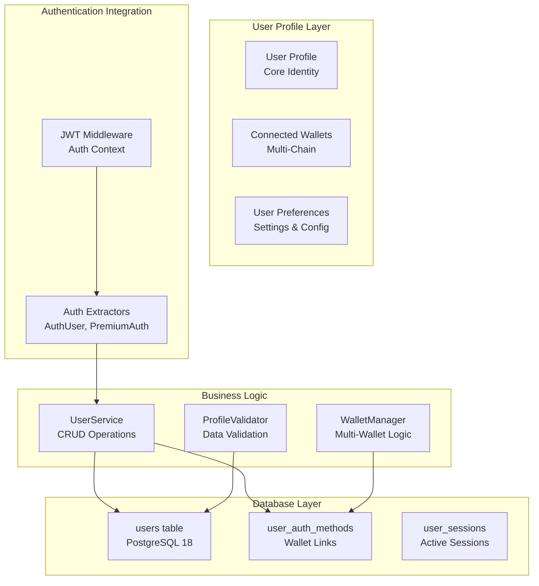
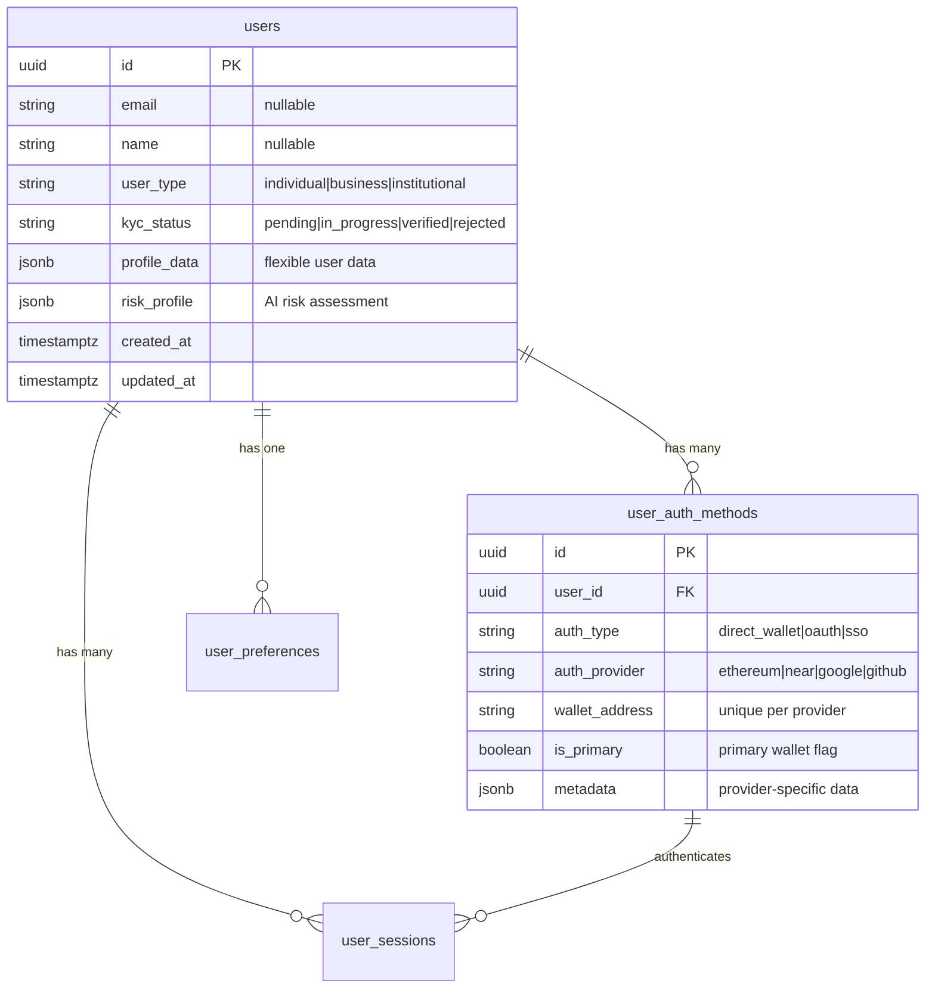

# KEMBridge User Management Implementation Guide

## 📋 Overview

Руководство по реализации системы управления пользователями для KEMBridge с интеграцией Web3 идентичности, профилей пользователей и множественных кошельков.

## 🎯 Objectives

### Core Goals
- **User Profile Management**: CRUD операции для пользовательских профилей
- **Multi-Wallet Support**: Связывание множественных кошельков с одним пользователем
- **KYC Integration**: Готовность к верификации личности
- **Privacy-First**: Минимальные требования к персональным данным
- **Web3 Native**: Wallet-first подход к управлению пользователями

### Technical Requirements
- **Type-Safe APIs**: Полная типизация через Rust/TypeScript
- **Database Integration**: Оптимизация PostgreSQL 18 queries
- **Auth Integration**: Seamless работа с JWT middleware
- **Performance**: Sub-50ms response times для profile endpoints
- **Security**: Role-based access с audit logging

## 🏗️ Architecture Design

### User Management Flow


### Data Model Relationships


## 🔧 Implementation Architecture

### Core User Service
```rust
// backend/crates/kembridge-auth/src/user_service.rs
use uuid::Uuid;
use sqlx::PgPool;
use serde::{Deserialize, Serialize};

#[derive(Debug, Clone, Serialize, Deserialize)]
pub struct UserProfile {
    pub id: Uuid,
    pub email: Option<String>,
    pub name: Option<String>,
    pub user_type: UserType,
    pub kyc_status: KycStatus,
    pub profile_data: serde_json::Value,
    pub risk_profile: serde_json::Value,
    pub created_at: chrono::DateTime<chrono::Utc>,
    pub updated_at: chrono::DateTime<chrono::Utc>,
}

#[derive(Debug, Clone, Serialize, Deserialize)]
pub enum UserType {
    Individual,
    Business,
    Institutional,
}

#[derive(Debug, Clone, Serialize, Deserialize)]
pub enum KycStatus {
    Pending,
    InProgress,
    Verified,
    Rejected,
}

pub struct UserService {
    db_pool: PgPool,
}

impl UserService {
    pub fn new(db_pool: PgPool) -> Self {
        Self { db_pool }
    }

    // Core CRUD operations
    pub async fn get_user_by_id(&self, user_id: Uuid) -> Result<Option<UserProfile>, UserError>;
    pub async fn get_user_by_wallet(&self, wallet_address: &str, chain_type: &str) -> Result<Option<UserProfile>, UserError>;
    pub async fn create_user(&self, request: CreateUserRequest) -> Result<UserProfile, UserError>;
    pub async fn update_user(&self, user_id: Uuid, request: UpdateUserRequest) -> Result<UserProfile, UserError>;
    pub async fn soft_delete_user(&self, user_id: Uuid) -> Result<(), UserError>;
    
    // Wallet management
    pub async fn add_wallet(&self, user_id: Uuid, wallet_request: AddWalletRequest) -> Result<(), UserError>;
    pub async fn remove_wallet(&self, user_id: Uuid, wallet_address: &str) -> Result<(), UserError>;
    pub async fn get_user_wallets(&self, user_id: Uuid) -> Result<Vec<UserWallet>, UserError>;
    pub async fn set_primary_wallet(&self, user_id: Uuid, wallet_address: &str) -> Result<(), UserError>;
}
```

### API Endpoints Design
```rust
// User Profile Management Endpoints
// GET /api/v1/user/profile - Get current user profile
// PUT /api/v1/user/profile - Update user profile
// DELETE /api/v1/user/profile - Soft delete account

// Wallet Management Endpoints  
// GET /api/v1/user/wallets - List connected wallets
// POST /api/v1/user/wallets - Add new wallet
// DELETE /api/v1/user/wallets/{address} - Remove wallet
// PUT /api/v1/user/wallets/{address}/primary - Set as primary

// Example handler signature
pub async fn get_user_profile(
    auth_user: AuthUser, // JWT middleware provides this
    State(state): State<AppState>,
) -> Result<Json<UserProfileResponse>, UserError>
```

### Multi-Wallet Management
```rust
#[derive(Debug, Serialize, Deserialize)]
pub struct UserWallet {
    pub wallet_address: String,
    pub chain_type: String,
    pub is_primary: bool,
    pub verified_at: Option<chrono::DateTime<chrono::Utc>>,
    pub metadata: serde_json::Value,
}

#[derive(Debug, Deserialize)]
pub struct AddWalletRequest {
    pub wallet_address: String,
    pub chain_type: String,
    pub signature: String, // Proof of ownership
    pub message: String,   // Signed message
}

impl UserService {
    pub async fn add_wallet(&self, user_id: Uuid, request: AddWalletRequest) -> Result<(), UserError> {
        // 1. Verify signature ownership
        // 2. Check wallet not already linked
        // 3. Add to user_auth_methods
        // 4. Audit log the addition
    }
}
```

## 🔐 Security & Validation

### Input Validation
```rust
use validator::{Validate, ValidationError};

#[derive(Debug, Deserialize, Validate)]
pub struct UpdateUserRequest {
    #[validate(email)]
    pub email: Option<String>,
    
    #[validate(length(min = 2, max = 100))]
    pub name: Option<String>,
    
    pub user_type: Option<UserType>,
    
    #[validate(custom = "validate_profile_data")]
    pub profile_data: Option<serde_json::Value>,
}

fn validate_profile_data(profile_data: &serde_json::Value) -> Result<(), ValidationError> {
    // Custom validation for profile data structure
    // Ensure no sensitive data in profile_data
    // Validate against schema
    Ok(())
}
```

### Authorization Rules
```rust
// Different access levels for user operations
// - Self: User can manage their own profile
// - Admin: Admin can view/manage any user  
// - System: System operations (automated processes)

pub async fn require_self_or_admin(
    auth_user: &AuthUser,
    target_user_id: Uuid,
) -> Result<(), UserError> {
    if auth_user.user_id == target_user_id || auth_user.is_admin() {
        Ok(())
    } else {
        Err(UserError::Forbidden)
    }
}
```

## 📊 Database Optimization

### Efficient Queries
```sql
-- Get user with wallets (optimized with JOIN)
SELECT 
    u.id, u.email, u.name, u.user_type, u.kyc_status,
    u.profile_data, u.risk_profile, u.created_at, u.updated_at,
    COALESCE(
        json_agg(
            json_build_object(
                'wallet_address', uam.wallet_address,
                'chain_type', uam.auth_provider,
                'is_primary', uam.is_primary,
                'verified_at', uam.created_at
            )
        ) FILTER (WHERE uam.id IS NOT NULL), 
        '[]'::json
    ) as wallets
FROM users u
LEFT JOIN user_auth_methods uam ON u.id = uam.user_id 
    AND uam.auth_type = 'direct_wallet'
WHERE u.id = $1
GROUP BY u.id;

-- Search users by wallet (with index optimization)
SELECT u.* FROM users u
JOIN user_auth_methods uam ON u.id = uam.user_id
WHERE uam.wallet_address = $1 
  AND uam.auth_provider = $2
  AND uam.auth_type = 'direct_wallet';
```

### Performance Indexes
```sql
-- Composite index for wallet lookups
CREATE INDEX CONCURRENTLY idx_user_auth_wallet_lookup 
ON user_auth_methods (wallet_address, auth_provider, auth_type)
WHERE auth_type = 'direct_wallet';

-- Partial index for active users
CREATE INDEX CONCURRENTLY idx_users_active 
ON users (id, updated_at) 
WHERE deleted_at IS NULL;
```

## 🧪 Testing Strategy

### Unit Tests Example
```rust
#[cfg(test)]
mod tests {
    use super::*;
    use sqlx::PgPool;

    #[tokio::test]
    async fn test_create_user_with_wallet() {
        let pool = setup_test_db().await;
        let user_service = UserService::new(pool);
        
        let request = CreateUserRequest {
            email: Some("test@example.com".to_string()),
            name: Some("Test User".to_string()),
            user_type: UserType::Individual,
            initial_wallet: Some(AddWalletRequest {
                wallet_address: "0x742d35Cc6635C0532925a3b8D400a69ee0f44AD2".to_string(),
                chain_type: "ethereum".to_string(),
                signature: "0x...".to_string(),
                message: "verification message".to_string(),
            }),
        };

        let user = user_service.create_user(request).await.unwrap();
        assert_eq!(user.email, Some("test@example.com".to_string()));
        
        let wallets = user_service.get_user_wallets(user.id).await.unwrap();
        assert_eq!(wallets.len(), 1);
        assert!(wallets[0].is_primary);
    }
}
```

## 🚀 Implementation Tasks

### Phase 2.3 Task Breakdown

#### 2.3.1 User Profile Endpoints
- Create `GET /api/v1/user/profile` handler
- Implement AuthUser extractor integration
- Add profile serialization/deserialization
- Include wallet information in profile response

#### 2.3.2 Profile Update Operations
- Create `PUT /api/v1/user/profile` handler
- Implement input validation with validator crate
- Add audit logging for profile changes
- Handle partial updates efficiently

#### 2.3.3 Multi-Wallet Management
- Create wallet addition flow with signature verification
- Implement wallet removal with security checks
- Add primary wallet designation logic
- Create wallet listing endpoint

#### 2.3.4 User Creation Flow
- Integrate with existing auth verification
- Create user on first successful wallet auth
- Handle edge cases (duplicate wallets, etc.)
- Set up default user preferences

#### 2.3.5 Soft Delete Implementation
- Add `deleted_at` field handling
- Implement soft delete logic
- Update queries to exclude deleted users
- Add data retention policies

#### 2.3.6 Data Validation & Security
- Implement comprehensive input validation
- Add rate limiting for profile operations
- Create authorization middleware for user operations
- Add GDPR compliance helpers

#### 2.3.7 Performance Optimization
- Optimize database queries with proper indexes
- Implement response caching where appropriate
- Add pagination for wallet lists
- Profile query performance monitoring

## 🎯 Success Criteria

### Functional Requirements
- ✅ Users can view their complete profile including all wallets
- ✅ Users can update their profile information safely
- ✅ Users can add multiple wallets with ownership verification
- ✅ Users can designate primary wallet for operations
- ✅ Admin users can manage other user profiles
- ✅ Soft delete preserves data while removing access

### Technical Requirements
- ✅ All endpoints use JWT authentication middleware
- ✅ Type-safe API with comprehensive error handling
- ✅ Database queries optimized for performance
- ✅ Comprehensive audit logging for compliance
- ✅ Input validation prevents malicious data
- ✅ Role-based authorization properly implemented

### Performance Targets
- ✅ Profile fetch: < 50ms response time
- ✅ Profile update: < 100ms response time
- ✅ Wallet operations: < 75ms response time
- ✅ Database queries: < 20ms execution time

## 🔄 Integration Points

### Frontend Integration
```typescript
// React hooks example for user management
export const useUserProfile = () => {
  const { authToken } = useAuth();
  
  const fetchProfile = async () => {
    const response = await fetch('/api/v1/user/profile', {
      headers: { 'Authorization': `Bearer ${authToken}` }
    });
    return response.json();
  };

  const updateProfile = async (updates: ProfileUpdates) => {
    const response = await fetch('/api/v1/user/profile', {
      method: 'PUT',
      headers: { 
        'Authorization': `Bearer ${authToken}`,
        'Content-Type': 'application/json'
      },
      body: JSON.stringify(updates)
    });
    return response.json();
  };

  return { fetchProfile, updateProfile };
};
```

### AI Risk Engine Integration
```rust
// Update risk profile when user data changes
pub async fn update_user_risk_profile(
    &self,
    user_id: Uuid,
    profile_changes: &UpdateUserRequest,
) -> Result<(), UserError> {
    // Analyze profile changes for risk indicators
    let risk_update = self.risk_engine
        .analyze_profile_update(user_id, profile_changes)
        .await?;
    
    // Update risk profile in database
    sqlx::query!(
        "UPDATE users SET risk_profile = risk_profile || $2 WHERE id = $1",
        user_id,
        risk_update
    )
    .execute(&self.db_pool)
    .await?;
    
    Ok(())
}
```

This guide provides a comprehensive roadmap for implementing Phase 2.3 User Management while maintaining integration with existing authentication and preparing for future phases.