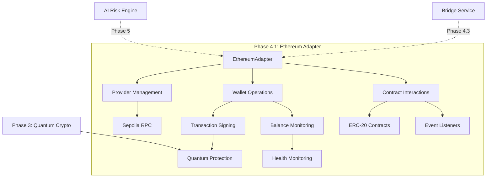

# Phase 4.1: Ethereum Adapter Implementation Guide

## 📋 Обзор фазы

**Цель:** Реализация Ethereum адаптера для взаимодействия с Sepolia testnet  
**Зависимости:** Phase 3.4 (Quantum Crypto API) - для защиты транзакций  
**Результат:** Работающий Ethereum адаптер с поддержкой ETH и ERC-20 операций

## 🎯 Ключевые принципы

1. **Testnet First:** Работаем только с Sepolia testnet для безопасности
2. **Quantum Protection:** Интеграция с Phase 3 для защиты приватных ключей
3. **Асинхронность:** Все операции должны быть неблокирующими
4. **Error Handling:** Comprehensive обработка blockchain ошибок

## 📚 Технические основы

### Ethereum Integration Stack

- **Библиотека:** `ethers-rs` v2.0+ - современная async Ethereum library
- **Testnet:** Sepolia (Chain ID: 11155111) - стабильная тестовая сеть
- **RPC Provider:** Infura или Alchemy для надежного подключения
- **Wallet Management:** LocalWallet с quantum-protected storage

### Архитектура адаптера



## 🏗️ Архитектура модуля

### Структура kembridge-blockchain crate

```
backend/crates/kembridge-blockchain/
├── Cargo.toml                    # ethers-rs и blockchain зависимости
├── src/
│   ├── lib.rs                    # Публичный API модуля
│   ├── ethereum/
│   │   ├── mod.rs               # Ethereum модуль
│   │   ├── adapter.rs           # EthereumAdapter основной
│   │   ├── contracts.rs         # ERC-20 и другие контракты
│   │   ├── wallet.rs            # Wallet management с quantum защитой
│   │   └── events.rs            # Event listeners и monitoring
│   ├── near/                    # Для Phase 4.2
│   ├── error.rs                 # Blockchain-специфичные ошибки
│   └── config.rs                # Конфигурация для разных сетей
└── tests/
    ├── ethereum_tests.rs        # Интеграционные тесты
    └── mock_contracts.rs        # Mock контракты для тестирования
```

### Интеграция в основной backend

```
backend/src/
├── services/
│   └── blockchain.rs            # BlockchainService для API endpoints
├── handlers/
│   └── ethereum.rs              # HTTP handlers для /api/v1/ethereum/*
├── routes/
│   └── blockchain.rs            # Роуты для blockchain endpoints
└── models/
    └── blockchain.rs            # Модели для blockchain операций
```

## 🔧 Технические задачи

### 4.1.1 Добавление ethers-rs зависимости

**Комментарий:** ✅ Реализуется в Phase 4.1 - базовые blockchain зависимости

```toml
# backend/crates/kembridge-blockchain/Cargo.toml
[dependencies]
ethers = { version = "2.0", features = ["rustls", "ws"] }
tokio = { version = "1.0", features = ["full"] }
serde = { version = "1.0", features = ["derive"] }
serde_json = "1.0"
thiserror = "1.0"
anyhow = "1.0"
tracing = "0.1"
uuid = { version = "1.0", features = ["v4"] }
chrono = { version = "0.4", features = ["serde"] }

# Интеграция с kembridge-crypto для защиты ключей
kembridge-crypto = { path = "../kembridge-crypto" }
```

### 4.1.2 Создание EthereumAdapter структуры

**Комментарий:** ✅ Реализуется в Phase 4.1 - основной адаптер

```rust
// kembridge-blockchain/src/ethereum/adapter.rs
use ethers::{
    providers::{Provider, Http, Middleware},
    types::{Address, U256, TransactionRequest, H256},
    signers::{LocalWallet, Signer},
};
use std::sync::Arc;
use kembridge_crypto::QuantumKeyManager;

pub struct EthereumAdapter {
    provider: Arc<Provider<Http>>,
    chain_id: u64,
    quantum_manager: QuantumKeyManager,
    config: EthereumConfig,
}

#[derive(Debug, Clone)]
pub struct EthereumConfig {
    pub rpc_url: String,
    pub chain_id: u64,
    pub gas_price_multiplier: f64,
    pub confirmation_blocks: u64,
    pub max_retry_attempts: u32,
}

impl EthereumAdapter {
    /// Создание нового Ethereum адаптера для Sepolia
    pub async fn new(config: EthereumConfig) -> Result<Self, EthereumError> {
        let provider = Provider::<Http>::try_from(&config.rpc_url)
            .map_err(|e| EthereumError::ConnectionFailed(e.to_string()))?;
        
        let provider = Arc::new(provider);
        
        // Проверка подключения к правильной сети
        let network_id = provider.get_chainid().await
            .map_err(|e| EthereumError::NetworkError(e.to_string()))?;
        
        if network_id.as_u64() != config.chain_id {
            return Err(EthereumError::InvalidNetwork {
                expected: config.chain_id,
                actual: network_id.as_u64(),
            });
        }

        Ok(Self {
            provider,
            chain_id: config.chain_id,
            quantum_manager: QuantumKeyManager::new(),
            config,
        })
    }
}
```

### 4.1.3 Настройка подключения к Sepolia testnet

**Комментарий:** ✅ Реализуется в Phase 4.1 - testnet конфигурация

```rust
// kembridge-blockchain/src/ethereum/config.rs
impl EthereumConfig {
    /// Конфигурация для Sepolia testnet
    pub fn sepolia() -> Self {
        Self {
            rpc_url: std::env::var("ETHEREUM_RPC_URL")
                .unwrap_or_else(|_| "https://sepolia.infura.io/v3/YOUR_INFURA_KEY".to_string()),
            chain_id: 11155111, // Sepolia Chain ID
            gas_price_multiplier: 1.2, // 20% запас для быстрого выполнения
            confirmation_blocks: 2, // Быстрые подтверждения в testnet
            max_retry_attempts: 3,
        }
    }
    
    /// Проверка валидности конфигурации
    pub fn validate(&self) -> Result<(), EthereumError> {
        if self.chain_id != 11155111 {
            return Err(EthereumError::InvalidNetwork {
                expected: 11155111,
                actual: self.chain_id,
            });
        }
        
        if !self.rpc_url.starts_with("https://") {
            return Err(EthereumError::InvalidConfiguration(
                "RPC URL must use HTTPS".to_string()
            ));
        }
        
        Ok(())
    }
}
```

### 4.1.4 Реализация отправки ETH транзакций

**Комментарий:** ✅ Реализуется в Phase 4.1 - базовые ETH операции

```rust
impl EthereumAdapter {
    /// Отправка ETH транзакции с quantum-protected wallet
    pub async fn send_eth(
        &self,
        from_private_key_id: uuid::Uuid,
        to: Address,
        amount: U256,
        user_id: uuid::Uuid,
    ) -> Result<H256, EthereumError> {
        // Получение и расшифровка приватного ключа через quantum crypto
        let private_key = self.get_decrypted_private_key(from_private_key_id, user_id).await?;
        
        let wallet = LocalWallet::from_bytes(&private_key)
            .map_err(|e| EthereumError::WalletError(e.to_string()))?
            .with_chain_id(self.chain_id);
        
        // Получение баланса и проверка достаточности средств
        let balance = self.provider.get_balance(wallet.address(), None).await
            .map_err(|e| EthereumError::NetworkError(e.to_string()))?;
        
        if balance < amount {
            return Err(EthereumError::InsufficientFunds {
                available: balance,
                required: amount,
            });
        }
        
        // Создание транзакции
        let tx = TransactionRequest::new()
            .to(to)
            .value(amount)
            .gas_price(self.estimate_gas_price().await?);
        
        // Подписание и отправка
        let signed_tx = wallet.sign_transaction(&tx).await
            .map_err(|e| EthereumError::SigningFailed(e.to_string()))?;
        
        let tx_hash = self.provider.send_raw_transaction(signed_tx).await
            .map_err(|e| EthereumError::TransactionFailed(e.to_string()))?;
        
        tracing::info!(
            tx_hash = %tx_hash,
            from = %wallet.address(),
            to = %to,
            amount = %amount,
            "ETH transaction sent"
        );
        
        Ok(tx_hash)
    }
    
    /// Получение зашифрованного приватного ключа из quantum storage
    async fn get_decrypted_private_key(
        &self,
        key_id: uuid::Uuid,
        user_id: uuid::Uuid,
    ) -> Result<Vec<u8>, EthereumError> {
        // TODO: Интеграция с QuantumService для расшифровки ключей
        // Пока возвращаем mock данные для компиляции
        tracing::warn!("Using mock private key - implement quantum decryption in Phase 4.3");
        
        // В реальной реализации:
        // 1. Получаем зашифрованный ключ из quantum_keys таблицы
        // 2. Используем quantum crypto для расшифровки
        // 3. Возвращаем расшифрованный private key
        
        Ok(vec![0u8; 32]) // Mock private key
    }
}
```

### 4.1.5 Создание mock ERC-20 контракта для тестирования

**Комментарий:** ⏸️ ОТЛОЖЕНО до Phase 4.3 - требует интеграции с bridge logic

**Причина отложения:** Mock ERC-20 контракт тесно связан с bridge механизмами и будет лучше реализован вместе с основной bridge логикой в Phase 4.3.

### 4.1.6 Реализация взаимодействия с ERC-20 токенами

**Комментарий:** ✅ Реализуется в Phase 4.1 - базовая ERC-20 поддержка

```rust
// kembridge-blockchain/src/ethereum/contracts.rs
use ethers::{
    contract::{Contract, ContractFactory},
    abi::{Abi, Token},
    types::{Address, U256},
};

pub struct ERC20Contract {
    contract: Contract<Provider<Http>>,
    address: Address,
}

impl ERC20Contract {
    /// Создание ERC-20 контракта
    pub async fn new(
        provider: Arc<Provider<Http>>,
        address: Address,
    ) -> Result<Self, EthereumError> {
        // Standard ERC-20 ABI
        let abi: Abi = serde_json::from_str(include_str!("../abis/erc20.json"))
            .map_err(|e| EthereumError::ContractError(e.to_string()))?;
        
        let contract = Contract::new(address, abi, provider);
        
        Ok(Self { contract, address })
    }
    
    /// Получение баланса токенов
    pub async fn balance_of(&self, owner: Address) -> Result<U256, EthereumError> {
        let balance: U256 = self.contract
            .method::<_, U256>("balanceOf", owner)?
            .call()
            .await
            .map_err(|e| EthereumError::ContractError(e.to_string()))?;
        
        Ok(balance)
    }
    
    /// Transfer токенов
    pub async fn transfer(
        &self,
        wallet: &LocalWallet,
        to: Address,
        amount: U256,
    ) -> Result<H256, EthereumError> {
        let contract_with_signer = self.contract.connect(wallet.clone());
        
        let tx = contract_with_signer
            .method::<_, H256>("transfer", (to, amount))?
            .send()
            .await
            .map_err(|e| EthereumError::ContractError(e.to_string()))?;
        
        Ok(tx.tx_hash())
    }
}
```

### 4.1.7 Добавление мониторинга баланса кошельков

**Комментарий:** ✅ Реализуется в Phase 4.1 - необходимо для bridge операций

```rust
impl EthereumAdapter {
    /// Мониторинг баланса ETH кошелька
    pub async fn get_eth_balance(&self, address: Address) -> Result<U256, EthereumError> {
        let balance = self.provider.get_balance(address, None).await
            .map_err(|e| EthereumError::NetworkError(e.to_string()))?;
        
        Ok(balance)
    }
    
    /// Мониторинг баланса ERC-20 токенов
    pub async fn get_token_balance(
        &self,
        token_address: Address,
        wallet_address: Address,
    ) -> Result<U256, EthereumError> {
        let erc20 = ERC20Contract::new(self.provider.clone(), token_address).await?;
        erc20.balance_of(wallet_address).await
    }
    
    /// Комплексный мониторинг кошелька
    pub async fn get_wallet_info(
        &self,
        address: Address,
        token_addresses: Vec<Address>,
    ) -> Result<WalletInfo, EthereumError> {
        let eth_balance = self.get_eth_balance(address).await?;
        let nonce = self.provider.get_transaction_count(address, None).await
            .map_err(|e| EthereumError::NetworkError(e.to_string()))?;
        
        let mut token_balances = Vec::new();
        for token_addr in token_addresses {
            match self.get_token_balance(token_addr, address).await {
                Ok(balance) => token_balances.push(TokenBalance {
                    token_address: token_addr,
                    balance,
                }),
                Err(e) => tracing::warn!(
                    token = %token_addr,
                    error = %e,
                    "Failed to get token balance"
                ),
            }
        }
        
        Ok(WalletInfo {
            address,
            eth_balance,
            nonce,
            token_balances,
            last_updated: chrono::Utc::now(),
        })
    }
}

#[derive(Debug, Clone)]
pub struct WalletInfo {
    pub address: Address,
    pub eth_balance: U256,
    pub nonce: U256,
    pub token_balances: Vec<TokenBalance>,
    pub last_updated: chrono::DateTime<chrono::Utc>,
}

#[derive(Debug, Clone)]
pub struct TokenBalance {
    pub token_address: Address,
    pub balance: U256,
}
```

### 4.1.8 Реализация подтверждения транзакций

**Комментарий:** ✅ Реализуется в Phase 4.1 - критично для надежности

```rust
impl EthereumAdapter {
    /// Ожидание подтверждения транзакции
    pub async fn wait_for_confirmation(
        &self,
        tx_hash: H256,
    ) -> Result<TransactionReceipt, EthereumError> {
        let receipt = self.provider
            .pending_transaction(tx_hash)
            .await
            .map_err(|e| EthereumError::TransactionFailed(e.to_string()))?
            .confirmations(self.config.confirmation_blocks)
            .await
            .map_err(|e| EthereumError::ConfirmationFailed(e.to_string()))?
            .ok_or(EthereumError::TransactionNotFound(tx_hash))?;
        
        // Проверка успешности транзакции
        if receipt.status != Some(1.into()) {
            return Err(EthereumError::TransactionReverted {
                tx_hash,
                gas_used: receipt.gas_used.unwrap_or_default(),
            });
        }
        
        tracing::info!(
            tx_hash = %tx_hash,
            block_number = %receipt.block_number.unwrap_or_default(),
            gas_used = %receipt.gas_used.unwrap_or_default(),
            "Transaction confirmed"
        );
        
        Ok(receipt)
    }
    
    /// Проверка статуса транзакции без ожидания
    pub async fn get_transaction_status(
        &self,
        tx_hash: H256,
    ) -> Result<TransactionStatus, EthereumError> {
        // Проверяем, есть ли транзакция в блокчейне
        match self.provider.get_transaction(tx_hash).await {
            Ok(Some(tx)) => {
                // Транзакция найдена, проверяем receipt
                match self.provider.get_transaction_receipt(tx_hash).await {
                    Ok(Some(receipt)) => {
                        let confirmations = self.provider.get_block_number().await
                            .map_err(|e| EthereumError::NetworkError(e.to_string()))?
                            .saturating_sub(receipt.block_number.unwrap_or_default())
                            + 1;
                        
                        Ok(TransactionStatus::Confirmed {
                            receipt,
                            confirmations: confirmations.as_u64(),
                        })
                    },
                    Ok(None) => Ok(TransactionStatus::Pending { transaction: tx }),
                    Err(e) => Err(EthereumError::NetworkError(e.to_string())),
                }
            },
            Ok(None) => Ok(TransactionStatus::NotFound),
            Err(e) => Err(EthereumError::NetworkError(e.to_string())),
        }
    }
}

#[derive(Debug, Clone)]
pub enum TransactionStatus {
    NotFound,
    Pending { transaction: Transaction },
    Confirmed { receipt: TransactionReceipt, confirmations: u64 },
}
```

### 4.1.9 Создание event listeners для входящих транзакций

**Комментарий:** ⏸️ ОТЛОЖЕНО до Phase 4.3 - требует BridgeService интеграции

**Причина отложения:** Event listeners тесно связаны с bridge workflow и мониторингом операций моста. Будет реализовано вместе с основной bridge логикой.

## 🔄 Связи с другими фазами

### Отложенные задачи Phase 4.1

**Комментарий:** ⏸️ Перенесено в Phase 4.3 - требует BridgeService

- **4.1.5** Создание mock ERC-20 контракта → Phase 4.3.2 (связано с lock/unlock механизмом)
- **4.1.9** Event listeners → Phase 4.3.6 (связано с atomic swap monitoring)

**Причины переноса:**

1. Mock ERC-20 контракт должен учитывать bridge механизмы
2. Event listeners требуют интеграции с BridgeService workflow
3. Phase 4.1 фокусируется на базовой Ethereum функциональности

### Зависимости от других фаз

- **Phase 3.4:** QuantumCrypto для защиты приватных ключей ✅
- **Phase 4.3:** BridgeService для координации операций
- **Phase 5.2:** AI Risk Engine для анализа транзакций
- **Phase 2.1:** AuthUser для связывания wallet addresses ✅

### Обратные ссылки в зависимых фазах

В Phase 4.3 будут добавлены комментарии:
- **4.3.2** 🔗 Завершит задачу 4.1.5 - создание ERC-20 контракта для lock/unlock
- **4.3.6** 🔗 Завершит задачу 4.1.9 - event listeners для atomic swap monitoring

## 📊 Критерии успеха Phase 4.1

### Технические требования:

- [ ] Подключение к Sepolia testnet работает
- [ ] Отправка ETH транзакций успешна
- [ ] Мониторинг балансов функционирует
- [ ] Подтверждение транзакций работает
- [ ] ERC-20 базовые операции (balance, transfer)
- [ ] Quantum-protected wallet integration
- [ ] Comprehensive error handling

### Производительность:

- [ ] Подключение к RPC < 1s
- [ ] Получение баланса < 500ms
- [ ] Отправка транзакции < 2s
- [ ] Подтверждение транзакции < 30s (Sepolia)

### Безопасность:

- [ ] Приватные ключи защищены quantum crypto
- [ ] Validation входящих данных
- [ ] Secure RPC connections (HTTPS only)
- [ ] Transaction replay protection

## ⚠️ Важные предупреждения

1. **Testnet Only:** Никогда не использовать mainnet без дополнительных проверок
2. **Private Keys:** Все приватные ключи должны храниться encrypted через quantum crypto
3. **Gas Limits:** Всегда устанавливать reasonable gas limits
4. **Error Handling:** Обрабатывать network failures gracefully

## 🚀 Следующие шаги

После завершения Phase 4.1:

1. **Phase 4.2:** NEAR Protocol Adapter - параллельная реализация
2. **Phase 4.3:** Basic Bridge Logic - объединение ETH и NEAR адаптеров
3. **Phase 5.2:** AI Risk Integration - анализ Ethereum транзакций
4. **Phase 6.1:** Price Oracle - интеграция с Chainlink для ETH/USD

---

**Итоговый результат Phase 4.1:** Работающий Ethereum адаптер с quantum-protected wallet management, готовый для интеграции в кросс-чейн мост.