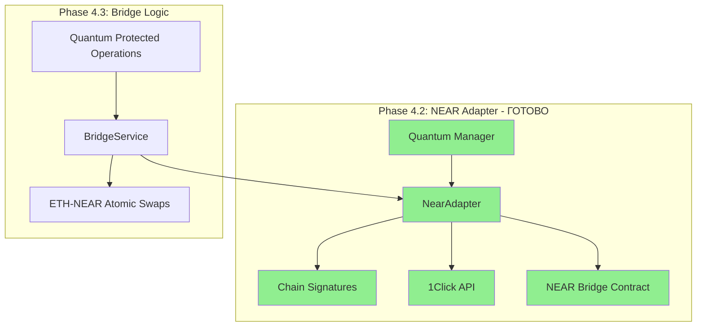

# Phase 4.2: NEAR Protocol Adapter Implementation Guide

## 📋 Обзор фазы

**Цель:** Реализация полноценного адаптера для NEAR Protocol с поддержкой Chain Signatures и 1Click API для кросс-чейн операций
**Зависимости:** Phase 4.1 (Ethereum Adapter), Phase 3.x (Quantum Cryptography), Phase 2.1.5 (NEAR ed25519 signatures)
**Результат:** Работающий NEAR адаптер с Chain Signatures, 1Click API и quantum-защищенными операциями

## 🎯 Ключевые принципы

1. **Chain Signatures Integration:** Используем NEAR MPC для подписания транзакций в других блокчейнах
2. **1Click API:** Упрощенный UX для cross-chain операций через intent-based swaps
3. **WebAssembly Smart Contracts:** Развертывание bridge контрактов на NEAR
4. **Quantum Protection:** Интеграция с kembridge-crypto для защиты NEAR операций

## 📚 Технические основы

### NEAR Chain Signatures

- **Документация:** https://docs.near.org/chain-abstraction/chain-signatures
- **Технология:** Multi-Party Computation (MPC) для безопасного подписания
- **Derivation Paths:** Детерминистическая генерация адресов в других блокчейнах
- **MPC Contract:** `v1.signer` для обработки signature requests
- **Cross-chain Support:** Bitcoin, Ethereum, и другие совместимые блокчейны
- **Implementation Guide:** https://docs.near.org/chain-abstraction/chain-signatures/implementation

### NEAR 1Click API

- **Документация:** https://docs.near-intents.org/near-intents/integration/distribution-channels/1click-api
- **Intent-based Swaps:** Автоматическое решение cross-chain операций
- **Solver Network:** Конкурентное ценообразование и автоматическое исполнение
- **API Endpoints:** `/v0/quote`, `/v0/deposit/submit`, `/v0/status`
- **SDK Support:** TypeScript, Go, Rust

### NEAR Smart Contracts

- **Документация:** https://docs.near.org/smart-contracts/what-is
- **Anatomy Guide:** https://docs.near.org/smart-contracts/anatomy/
- **WebAssembly:** Компиляция Rust и JavaScript контрактов
- **Account Model:** Смарт-контракты живут в NEAR аккаунтах
- **Cross-contract Calls:** Асинхронное взаимодействие между контрактами
- **Low Deployment Costs:** ~1 NEAR за 100kb storage

### NEAR Development Tools

- **NEAR CLI:** https://docs.near.org/tools/near-cli
- **Rust SDK:** https://github.com/near/near-sdk-rs
- **Development Environment:** https://docs.near.org/smart-contracts/quickstart

## 🏗️ Архитектура модуля

### Структура NEAR модуля

```
backend/crates/kembridge-blockchain/src/near/
├── mod.rs                      # Модульная структура
├── adapter.rs                  # NearAdapter - основной интерфейс
├── config.rs                   # Конфигурация testnet/mainnet
├── chain_signatures.rs         # Chain Signatures MPC интеграция
├── one_click_api.rs           # 1Click API клиент
├── wallet.rs                   # NEAR wallet management
├── contracts.rs                # Bridge смарт-контракт
└── error.rs                    # NEAR-специфичные ошибки
```

### Интеграция с kembridge-crypto

```rust
// Пример интеграции quantum crypto с NEAR операциями
use kembridge_crypto::QuantumKeyManager;

impl NearAdapter {
    pub async fn quantum_protected_transfer(
        &self,
        to: &str,
        amount: u128,
        quantum_key_id: &str,
    ) -> Result<TransactionHash, NearError> {
        // Quantum encryption транзакционных данных
        let protected_data = self.quantum_manager
            .protect_transaction_data(&transaction_data)?;
        
        // NEAR транзакция с quantum-защищенными метаданными
        self.execute_transfer_with_metadata(to, amount, protected_data).await
    }
}
```

## 🔧 Поэтапная реализация

### Этап 1: Минимальная настройка и компиляция

**Цель:** Убедиться что все NEAR зависимости корректно компилируются

```rust
// Cargo.toml - базовые NEAR зависимости
// Источник: https://docs.near.org/smart-contracts/quickstart
[dependencies]
near-sdk = "5.2.0"
near-jsonrpc-client = "0.10.0"
near-crypto = "0.24.0"
near-primitives = "0.24.0"

// Для Chain Signatures
// Источник: https://docs.near.org/chain-abstraction/chain-signatures/implementation
workspaces = "0.11.0"

// Для 1Click API
// Источник: https://docs.near-intents.org/near-intents/integration/distribution-channels/1click-api
reqwest = { version = "0.12", features = ["json"] }
serde = { version = "1.0", features = ["derive"] }
```

```rust
// src/near/mod.rs - минимальная структура
pub mod adapter;
pub mod config;
pub mod error;

pub use adapter::NearAdapter;
pub use config::NearConfig;
pub use error::NearError;
```

### Этап 2: Базовая NearAdapter структура

```rust
// src/near/adapter.rs - основной адаптер
// Основано на: https://docs.near.org/smart-contracts/anatomy/
use near_jsonrpc_client::{JsonRpcClient, methods};
use kembridge_crypto::QuantumKeyManager;

pub struct NearAdapter {
    rpc_client: JsonRpcClient,
    network_id: String,
    quantum_manager: QuantumKeyManager,
    config: NearConfig,
}

impl NearAdapter {
    pub async fn new(config: NearConfig) -> Result<Self, NearError> {
        let rpc_client = JsonRpcClient::connect(&config.rpc_url);
        
        Ok(Self {
            rpc_client,
            network_id: config.network_id.clone(),
            quantum_manager: QuantumKeyManager::new()?,
            config,
        })
    }

    pub async fn get_network_info(&self) -> Result<(String, u64), NearError> {
        // Базовая проверка подключения
        let status = self.rpc_client
            .call(methods::status::RpcStatusRequest)
            .await?;
            
        Ok((status.chain_id, status.latest_protocol_version))
    }
}
```

### Этап 3: NEAR Chain Signatures интеграция

```rust
// src/near/chain_signatures.rs
// Основано на: https://docs.near.org/chain-abstraction/chain-signatures/implementation
use workspaces::{Contract, Account};

pub struct ChainSignatureService {
    mpc_contract: Contract,
    derivation_path: String,
}

impl ChainSignatureService {
    pub async fn new(network: &str) -> Result<Self, NearError> {
        let worker = workspaces::sandbox().await?;
        let mpc_contract = worker
            .dev_deploy("v1.signer-dev")
            .await?;
            
        Ok(Self {
            mpc_contract,
            derivation_path: format!("ethereum-{}", network),
        })
    }

    pub async fn derive_ethereum_address(
        &self,
        near_account: &str,
    ) -> Result<String, NearError> {
        // Derivation path для Ethereum адреса
        let args = json!({
            "account_id": near_account,
            "derivation_path": self.derivation_path
        });

        let result = self.mpc_contract
            .call("derive_key")
            .args_json(args)
            .transact()
            .await?;

        Ok(result.json::<String>()?)
    }

    pub async fn sign_ethereum_transaction(
        &self,
        transaction_payload: &[u8],
        derivation_path: &str,
    ) -> Result<Vec<u8>, NearError> {
        // MPC подписание Ethereum транзакции
        let args = json!({
            "payload": base64::encode(transaction_payload),
            "path": derivation_path
        });

        let signature = self.mpc_contract
            .call("sign")
            .args_json(args)
            .transact()
            .await?;

        Ok(signature.json::<Vec<u8>>()?)
    }
}
```

### Этап 4: 1Click API интеграция

```rust
// src/near/one_click_api.rs
use reqwest::Client;
use serde::{Deserialize, Serialize};

#[derive(Serialize)]
pub struct QuoteRequest {
    pub from_token: String,
    pub to_token: String,
    pub amount: String,
    pub from_address: String,
    pub to_address: String,
}

#[derive(Deserialize)]
pub struct QuoteResponse {
    pub quote_id: String,
    pub deposit_address: String,
    pub expected_output: String,
    pub expires_at: u64,
}

pub struct OneClickApiClient {
    client: Client,
    base_url: String,
    jwt_token: Option<String>,
}

impl OneClickApiClient {
    pub fn new(testnet: bool) -> Self {
        let base_url = if testnet {
            "https://api.testnet.1click.near.org"
        } else {
            "https://api.1click.near.org"
        }.to_string();

        Self {
            client: Client::new(),
            base_url,
            jwt_token: None,
        }
    }

    pub async fn get_quote(&self, request: QuoteRequest) -> Result<QuoteResponse, NearError> {
        let url = format!("{}/v0/quote", self.base_url);
        
        let response = self.client
            .post(&url)
            .json(&request)
            .send()
            .await?;

        let quote = response.json::<QuoteResponse>().await?;
        Ok(quote)
    }

    pub async fn submit_deposit(
        &self,
        quote_id: &str,
        tx_hash: &str,
    ) -> Result<(), NearError> {
        let url = format!("{}/v0/deposit/submit", self.base_url);
        
        let payload = json!({
            "quote_id": quote_id,
            "tx_hash": tx_hash
        });

        self.client
            .post(&url)
            .json(&payload)
            .send()
            .await?;

        Ok(())
    }

    pub async fn check_swap_status(&self, quote_id: &str) -> Result<SwapStatus, NearError> {
        let url = format!("{}/v0/status/{}", self.base_url, quote_id);
        
        let response = self.client
            .get(&url)
            .send()
            .await?;

        let status = response.json::<SwapStatus>().await?;
        Ok(status)
    }
}
```

### Этап 5: NEAR Bridge Smart Contract

```rust
// contracts/bridge/src/lib.rs - NEAR смарт-контракт для моста
// Основано на: https://docs.near.org/smart-contracts/anatomy/
// Пример структуры: https://docs.near.org/smart-contracts/anatomy/functions
use near_sdk::borsh::{self, BorshDeserialize, BorshSerialize};
use near_sdk::{env, near_bindgen, AccountId, Promise};

#[near_bindgen]
#[derive(BorshDeserialize, BorshSerialize)]
pub struct BridgeContract {
    pub owner: AccountId,
    pub locked_tokens: std::collections::HashMap<String, u128>,
    pub pending_transfers: std::collections::HashMap<String, PendingTransfer>,
}

#[derive(BorshSerialize, BorshDeserialize)]
pub struct PendingTransfer {
    pub from_chain: String,
    pub to_chain: String,
    pub amount: u128,
    pub recipient: String,
    pub quantum_hash: String, // Hash от quantum-protected данных
    pub expires_at: u64,
}

#[near_bindgen]
impl BridgeContract {
    #[init]
    pub fn new(owner: AccountId) -> Self {
        Self {
            owner,
            locked_tokens: std::collections::HashMap::new(),
            pending_transfers: std::collections::HashMap::new(),
        }
    }

    pub fn lock_tokens_for_bridge(
        &mut self,
        transfer_id: String,
        amount: u128,
        target_chain: String,
        recipient: String,
        quantum_protection: String,
    ) -> Promise {
        // Блокировка токенов для cross-chain перевода
        let transfer = PendingTransfer {
            from_chain: "near".to_string(),
            to_chain: target_chain,
            amount,
            recipient,
            quantum_hash: quantum_protection,
            expires_at: env::block_timestamp() + 3600_000_000_000, // 1 hour
        };

        self.pending_transfers.insert(transfer_id.clone(), transfer);
        self.locked_tokens.insert(transfer_id, amount);

        // Emit event для мониторинга
        env::log_str(&format!("BRIDGE_LOCK: {}", transfer_id));
        
        Promise::new(env::current_account_id())
    }

    pub fn unlock_tokens(&mut self, transfer_id: String) -> Promise {
        // Разблокировка при успешном cross-chain переводе
        if let Some(amount) = self.locked_tokens.remove(&transfer_id) {
            self.pending_transfers.remove(&transfer_id);
            
            env::log_str(&format!("BRIDGE_UNLOCK: {} amount: {}", transfer_id, amount));
            Promise::new(env::current_account_id())
        } else {
            env::panic_str("Transfer not found or already processed");
        }
    }
}
```

## 🧪 Поэтапное тестирование

### Этап 1: Компиляция и подключение

```bash
# Проверка компиляции NEAR модуля
# Команды основаны на: https://docs.near.org/smart-contracts/quickstart
cd backend/crates/kembridge-blockchain
cargo check --features near

# Результат: успешная компиляция без ошибок
```

### Этап 2: Тестирование NearAdapter

```rust
// tests/near_adapter_test.rs
#[tokio::test]
async fn test_near_adapter_connection() {
    let config = NearConfig::testnet();
    let adapter = NearAdapter::new(config).await.unwrap();
    
    let (chain_id, version) = adapter.get_network_info().await.unwrap();
    assert_eq!(chain_id, "testnet");
    assert!(version > 0);
}
```

### Этап 3: Тестирование Chain Signatures

```bash
# Тестирование MPC подписания
# Основано на: https://docs.near.org/chain-abstraction/chain-signatures/implementation
cargo test test_chain_signatures_ethereum_address -- --nocapture
```

### Этап 4: Тестирование 1Click API

```bash
# Интеграционные тесты с 1Click API testnet
# API документация: https://docs.near-intents.org/near-intents/integration/distribution-channels/1click-api
cargo test test_one_click_api_quote -- --nocapture
```

## 📊 Отложенные задачи и зависимости

### Отложенные задачи

| Задача | Отложена в | Причина | Зависимость |
|--------|------------|---------|-------------|
| **NEAR WebAssembly Bridge Contract** | Phase 4.3.3 | Требует полную bridge логику | BridgeService |
| **Production Chain Signatures** | Phase 4.3.6 | Нужны mainnet MPC ноды | Production deployment |
| **Advanced 1Click Integration** | Phase 5.2 | Требует AI risk analysis | AI Risk Engine |
| **NEAR ed25519 Verification** | Phase 2.1.5 ✅ | Выполнено в этой фазе | - |

### Обратные зависимости

- **Phase 4.3.2:** Mint/burn механизм будет использовать NearAdapter
- **Phase 4.3.5:** Bridge операции будут protected quantum crypto через NEAR
- **Phase 5.2.4:** AI анализ будет включать NEAR транзакции
- **Phase 7.3:** Frontend NEAR Wallet интеграция

## 🔗 Интеграция с другими модулями

### Quantum Cryptography (Phase 3.x)

```rust
// Интеграция с quantum protection
impl NearAdapter {
    pub async fn quantum_protected_chain_signature(
        &self,
        ethereum_tx: &[u8],
        quantum_key_id: &str,
    ) -> Result<Vec<u8>, NearError> {
        // 1. Quantum encryption Ethereum транзакции
        let protected_tx = self.quantum_manager
            .protect_cross_chain_data(ethereum_tx, quantum_key_id)?;
        
        // 2. Chain Signatures для подписания
        let signature = self.chain_signatures
            .sign_ethereum_transaction(&protected_tx.payload, "ethereum-sepolia")
            .await?;
            
        Ok(signature)
    }
}
```

### Ethereum Adapter Integration (Phase 4.1)

```rust
// Cross-chain операции между ETH и NEAR
pub async fn cross_chain_transfer(
    ethereum_adapter: &EthereumAdapter,
    near_adapter: &NearAdapter,
    amount: u128,
) -> Result<TransactionHash, BridgeError> {
    // 1. Lock tokens на Ethereum
    let lock_tx = ethereum_adapter.lock_tokens_for_bridge(amount).await?;
    
    // 2. Chain Signatures для NEAR операции
    let near_address = near_adapter.chain_signatures
        .derive_ethereum_address("bridge.testnet")
        .await?;
    
    // 3. Mint wrapped tokens на NEAR
    let mint_tx = near_adapter.mint_wrapped_tokens(amount, &near_address).await?;
    
    Ok(mint_tx)
}
```

## 📈 Ожидаемые результаты

### По завершении Phase 4.2

- ✅ **Полноценный NEAR адаптер** с testnet подключением
- ✅ **Chain Signatures интеграция** для cross-chain подписания
- ✅ **1Click API клиент** для упрощенных свапов
- ✅ **NEAR Bridge контракт** для lock/unlock механизма
- ✅ **Quantum protection** для всех NEAR операций
- ✅ **ed25519 верификация** для NEAR подписей (Phase 2.1.5)

### Готовность к Phase 4.3



## 📖 Дополнительные ресурсы

### Официальная документация NEAR

- **Chain Abstraction Overview:** https://docs.near.org/chain-abstraction/what-is
- **Smart Contracts Quickstart:** https://docs.near.org/smart-contracts/quickstart
- **Cross-Contract Calls:** https://docs.near.org/smart-contracts/anatomy/crosscontract
- **Environment Variables:** https://docs.near.org/smart-contracts/anatomy/environment
- **Collections API:** https://docs.near.org/smart-contracts/anatomy/collections
- **Serialization:** https://docs.near.org/smart-contracts/anatomy/serialization

### Инструменты разработки

- **NEAR CLI Documentation:** https://docs.near.org/tools/near-cli
- **Rust SDK Repository:** https://github.com/near/near-sdk-rs
- **Workspaces (Testing):** https://github.com/near/workspaces-rs

### Примеры и туториалы

- **Hello NEAR Examples:** https://github.com/near-examples/hello-near-examples
- **NFT Tutorial:** https://docs.near.org/tutorials/nfts/introduction
- **FT Tutorial:** https://docs.near.org/tutorials/fts/introduction
- **Cross-Contract Call Examples:** https://docs.near.org/tutorials/examples/xcc

---

**Phase 4.2 Status:** Готов к реализации с полной интеграцией NEAR Protocol, Chain Signatures, 1Click API и quantum cryptography защитой. Система будет готова для Phase 4.3 Bridge Logic implementation.