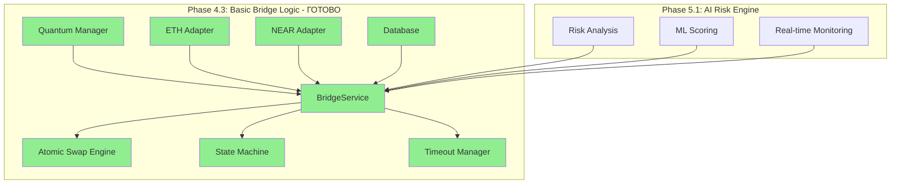

# Phase 4.3: Basic Bridge Logic Implementation Guide

## 📋 Обзор фазы

**Цель:** Реализация основной логики кросс-чейн моста для безопасных и атомарных операций между Ethereum и NEAR Protocol  
**Зависимости:** Phase 4.1 (Ethereum Adapter), Phase 4.2 (NEAR Protocol Adapter), Phase 3.x (Quantum Cryptography)  
**Результат:** Работающий базовый мост с квантовой защитой для ETH → NEAR операций

## 🎯 Ключевые принципы

1. **Atomic Operations:** Все bridge операции должны быть атомарными (либо успешные, либо откатываются)
2. **Quantum Security:** Полная интеграция с ML-KEM-1024 для защиты критических данных
3. **Chain Signatures:** Использование NEAR MPC для безопасного управления Ethereum активами
4. **Timeout Protection:** Автоматический откат операций при превышении времени ожидания
5. **Comprehensive Logging:** Сохранение всех операций в БД для аудита и мониторинга

## 📚 Технические основы

### Cross-Chain Bridge Architecture

- **Lock/Unlock Pattern:** Блокировка токенов на исходном блокчейне
- **Mint/Burn Pattern:** Создание/уничтожение wrapped токенов на целевом блокчейне  
- **Atomic Swap Logic:** Гарантия атомарности операций через state machine
- **Event-Driven Architecture:** Мониторинг blockchain событий для координации

### Quantum-Protected Bridge Operations

- **Transaction Encryption:** Шифрование sensitive данных транзакций
- **Key Rotation:** Автоматическая ротация quantum ключей для безопасности
- **Integrity Verification:** HMAC-SHA256 для проверки целостности данных
- **Secure Key Exchange:** HKDF для безопасного обмена ключами между цепями

## 🏗️ Архитектура модуля

### Структура Bridge Service

```
backend/crates/kembridge-bridge/src/
├── lib.rs                      # Публичный API модуля
├── service.rs                  # BridgeService - основная логика
├── swap_engine.rs              # Atomic swap координация
├── state_machine.rs            # State management для операций
├── validation.rs               # Валидация операций и параметров
├── timeout_manager.rs          # Управление таймаутами и откатами
├── event_handler.rs            # Обработка blockchain событий
├── quantum_bridge.rs           # Quantum crypto интеграция
└── error.rs                    # Bridge-специфичные ошибки
```

### Интеграция с зависимостями

```rust
// Зависимости из предыдущих фаз
use kembridge_crypto::QuantumKeyManager;        // Phase 3.x
use kembridge_blockchain::EthereumAdapter;      // Phase 4.1
use kembridge_blockchain::NearAdapter;          // Phase 4.2
use kembridge_database::models::Transaction;    // Phase 1.2
use kembridge_auth::AuthUser;                   // Phase 2.x
```

## 🔧 Поэтапная реализация

### Этап 1: Создание kembridge-bridge crate

**Цель:** Создать новый crate для bridge логики и настроить зависимости

```toml
# Cargo.toml - kembridge-bridge dependencies
[package]
name = "kembridge-bridge"
version = "0.1.0"
edition = "2021"

[dependencies]
# Внутренние зависимости
kembridge-crypto = { path = "../kembridge-crypto" }
kembridge-blockchain = { path = "../kembridge-blockchain" }
kembridge-database = { path = "../kembridge-database" }
kembridge-auth = { path = "../kembridge-auth" }

# Async runtime
tokio = { version = "1.46", features = ["full"] }
futures = "0.3"

# Serialization
serde = { version = "1.0", features = ["derive"] }
serde_json = "1.0"
uuid = { version = "1.10", features = ["v4", "serde"] }

# Time management
chrono = { version = "0.4", features = ["serde"] }

# Error handling
thiserror = "2.0"
anyhow = "1.0"

# Logging
tracing = "0.1"

# Database
sqlx = { version = "0.8", features = ["runtime-tokio-rustls", "postgres", "uuid", "chrono"] }
```

### Этап 2: Базовая BridgeService структура

```rust
// src/service.rs - основной сервис
use crate::{SwapEngine, StateMachine, ValidationService, TimeoutManager};
use kembridge_crypto::QuantumKeyManager;
use kembridge_blockchain::{EthereumAdapter, NearAdapter};
use kembridge_database::DbPool;

pub struct BridgeService {
    ethereum_adapter: EthereumAdapter,
    near_adapter: NearAdapter,
    quantum_manager: QuantumKeyManager,
    swap_engine: SwapEngine,
    state_machine: StateMachine,
    validation_service: ValidationService,
    timeout_manager: TimeoutManager,
    db_pool: DbPool,
}

impl BridgeService {
    pub async fn new(
        ethereum_adapter: EthereumAdapter,
        near_adapter: NearAdapter,
        quantum_manager: QuantumKeyManager,
        db_pool: DbPool,
    ) -> Result<Self, BridgeError> {
        Ok(Self {
            ethereum_adapter,
            near_adapter,
            quantum_manager: quantum_manager.clone(),
            swap_engine: SwapEngine::new(quantum_manager.clone()).await?,
            state_machine: StateMachine::new(),
            validation_service: ValidationService::new(),
            timeout_manager: TimeoutManager::new(),
            db_pool,
        })
    }

    pub async fn init_swap(
        &self,
        user_id: uuid::Uuid,
        from_chain: &str,
        to_chain: &str,
        amount: u128,
        recipient: &str,
    ) -> Result<SwapInitResponse, BridgeError> {
        // Валидация параметров
        self.validation_service.validate_swap_params(
            from_chain, to_chain, amount, recipient
        ).await?;

        // Создание swap операции
        let swap_id = uuid::Uuid::new_v4();
        let swap_operation = self.swap_engine.create_swap_operation(
            swap_id,
            user_id,
            from_chain,
            to_chain,
            amount,
            recipient,
        ).await?;

        // Сохранение в БД
        self.save_swap_operation(&swap_operation).await?;

        Ok(SwapInitResponse {
            swap_id,
            status: SwapStatus::Initialized,
            estimated_time: chrono::Duration::minutes(5),
        })
    }
}
```

### Этап 3: Atomic Swap Engine

```rust
// src/swap_engine.rs - атомарная swap логика
use crate::{BridgeError, SwapOperation, SwapStatus};
use kembridge_crypto::QuantumKeyManager;

pub struct SwapEngine {
    quantum_manager: QuantumKeyManager,
}

impl SwapEngine {
    pub async fn new(quantum_manager: QuantumKeyManager) -> Result<Self, BridgeError> {
        Ok(Self { quantum_manager })
    }

    pub async fn execute_eth_to_near_swap(
        &self,
        swap_operation: &SwapOperation,
        ethereum_adapter: &EthereumAdapter,
        near_adapter: &NearAdapter,
    ) -> Result<SwapResult, BridgeError> {
        // Step 1: Quantum protection для критических данных
        let quantum_key_id = self.quantum_manager
            .generate_keys("bridge-operation", "ml-kem-1024")
            .await?;

        let protected_data = self.quantum_manager
            .protect_transaction_data(
                &swap_operation.serialize()?,
                &quantum_key_id,
            )?;

        // Step 2: Lock ETH на Ethereum
        let lock_result = ethereum_adapter
            .lock_tokens_for_bridge(
                &swap_operation.swap_id.to_string(),
                swap_operation.amount,
                &protected_data,
            )
            .await?;

        // Step 3: Derive NEAR address через Chain Signatures
        let near_address = near_adapter
            .chain_signatures
            .derive_ethereum_address(&swap_operation.recipient)
            .await?;

        // Step 4: Mint wrapped tokens на NEAR
        let mint_result = near_adapter
            .mint_wrapped_tokens(
                swap_operation.amount,
                &near_address,
                &protected_data,
            )
            .await?;

        // Step 5: Verify atomic completion
        self.verify_atomic_completion(&lock_result, &mint_result).await?;

        Ok(SwapResult {
            swap_id: swap_operation.swap_id,
            eth_tx_hash: lock_result.transaction_hash,
            near_tx_hash: mint_result.transaction_hash,
            status: SwapStatus::Completed,
            quantum_key_id,
        })
    }

    async fn verify_atomic_completion(
        &self,
        lock_result: &EthereumLockResult,
        mint_result: &NearMintResult,
    ) -> Result<(), BridgeError> {
        // Верификация что обе операции успешно завершены
        if !lock_result.confirmed || !mint_result.confirmed {
            return Err(BridgeError::AtomicOperationFailed);
        }

        // Проверка quantum integrity
        if lock_result.quantum_hash != mint_result.quantum_hash {
            return Err(BridgeError::QuantumIntegrityViolation);
        }

        Ok(())
    }
}
```

### Этап 4: State Machine для операций

```rust
// src/state_machine.rs - управление состояниями
use crate::{SwapOperation, SwapStatus, BridgeError};

pub struct StateMachine {
    // State transitions map
    transitions: HashMap<SwapStatus, Vec<SwapStatus>>,
}

impl StateMachine {
    pub fn new() -> Self {
        let mut transitions = HashMap::new();
        
        // Определяем допустимые переходы состояний
        transitions.insert(
            SwapStatus::Initialized,
            vec![SwapStatus::EthLocking, SwapStatus::Failed, SwapStatus::Cancelled]
        );
        
        transitions.insert(
            SwapStatus::EthLocking,
            vec![SwapStatus::EthLocked, SwapStatus::Failed, SwapStatus::Timeout]
        );
        
        transitions.insert(
            SwapStatus::EthLocked,
            vec![SwapStatus::NearMinting, SwapStatus::Failed, SwapStatus::Timeout]
        );
        
        transitions.insert(
            SwapStatus::NearMinting,
            vec![SwapStatus::NearMinted, SwapStatus::Failed, SwapStatus::Timeout]
        );
        
        transitions.insert(
            SwapStatus::NearMinted,
            vec![SwapStatus::Completed, SwapStatus::Failed]
        );

        Self { transitions }
    }

    pub fn can_transition(&self, from: SwapStatus, to: SwapStatus) -> bool {
        self.transitions
            .get(&from)
            .map(|allowed| allowed.contains(&to))
            .unwrap_or(false)
    }

    pub async fn transition_state(
        &self,
        swap_operation: &mut SwapOperation,
        new_status: SwapStatus,
    ) -> Result<(), BridgeError> {
        if !self.can_transition(swap_operation.status, new_status) {
            return Err(BridgeError::InvalidStateTransition {
                from: swap_operation.status,
                to: new_status,
            });
        }

        swap_operation.status = new_status;
        swap_operation.updated_at = chrono::Utc::now();

        Ok(())
    }
}
```

### Этап 5: Timeout Manager и Rollback

```rust
// src/timeout_manager.rs - управление таймаутами
use crate::{SwapOperation, SwapStatus, BridgeError};
use tokio::time::{sleep, Duration};

pub struct TimeoutManager {
    default_timeout: Duration,
}

impl TimeoutManager {
    pub fn new() -> Self {
        Self {
            default_timeout: Duration::from_secs(300), // 5 минут
        }
    }

    pub async fn monitor_operation_timeout(
        &self,
        swap_id: uuid::Uuid,
        bridge_service: Arc<BridgeService>,
    ) -> Result<(), BridgeError> {
        sleep(self.default_timeout).await;

        // Проверяем статус операции после таймаута
        let operation = bridge_service
            .get_swap_operation(swap_id)
            .await?;

        match operation.status {
            SwapStatus::Completed => {
                // Операция успешно завершена
                Ok(())
            }
            SwapStatus::Failed | SwapStatus::Cancelled => {
                // Операция уже обработана
                Ok(())
            }
            _ => {
                // Операция зависла - инициируем rollback
                self.initiate_rollback(swap_id, bridge_service).await
            }
        }
    }

    async fn initiate_rollback(
        &self,
        swap_id: uuid::Uuid,
        bridge_service: Arc<BridgeService>,
    ) -> Result<(), BridgeError> {
        tracing::warn!("Initiating rollback for swap {}", swap_id);

        let operation = bridge_service
            .get_swap_operation(swap_id)
            .await?;

        match operation.status {
            SwapStatus::EthLocked => {
                // Unlock ETH tokens
                bridge_service
                    .ethereum_adapter
                    .unlock_tokens(&operation.swap_id.to_string())
                    .await?;
            }
            SwapStatus::NearMinted => {
                // Burn NEAR tokens and unlock ETH
                bridge_service
                    .near_adapter
                    .burn_wrapped_tokens(
                        operation.amount,
                        &operation.recipient,
                    )
                    .await?;

                bridge_service
                    .ethereum_adapter
                    .unlock_tokens(&operation.swap_id.to_string())
                    .await?;
            }
            _ => {
                // Для других состояний специальный rollback не нужен
            }
        }

        // Обновляем статус операции
        bridge_service
            .update_swap_status(swap_id, SwapStatus::RolledBack)
            .await?;

        Ok(())
    }
}
```

### Этап 6: HTTP API интеграция

```rust
// HTTP handlers для integration с основным backend
use axum::{Json, extract::Path, response::Json as JsonResponse};
use kembridge_auth::AuthUser;

#[derive(serde::Deserialize)]
pub struct InitSwapRequest {
    pub from_chain: String,
    pub to_chain: String,
    pub amount: String, // String для точности с большими числами
    pub recipient: String,
}

#[derive(serde::Serialize)]
pub struct InitSwapResponse {
    pub swap_id: uuid::Uuid,
    pub status: String,
    pub estimated_time_minutes: i64,
}

pub async fn init_swap_handler(
    auth_user: AuthUser,
    Json(request): Json<InitSwapRequest>,
    bridge_service: Arc<BridgeService>,
) -> Result<JsonResponse<InitSwapResponse>, BridgeError> {
    let amount = request.amount.parse::<u128>()
        .map_err(|_| BridgeError::InvalidAmount)?;

    let result = bridge_service
        .init_swap(
            auth_user.id,
            &request.from_chain,
            &request.to_chain,
            amount,
            &request.recipient,
        )
        .await?;

    Ok(JsonResponse(InitSwapResponse {
        swap_id: result.swap_id,
        status: result.status.to_string(),
        estimated_time_minutes: result.estimated_time.num_minutes(),
    }))
}

pub async fn get_swap_status_handler(
    auth_user: AuthUser,
    Path(swap_id): Path<uuid::Uuid>,
    bridge_service: Arc<BridgeService>,
) -> Result<JsonResponse<SwapStatusResponse>, BridgeError> {
    let operation = bridge_service
        .get_swap_operation(swap_id)
        .await?;

    // Проверка что пользователь может видеть эту операцию
    if operation.user_id != auth_user.id {
        return Err(BridgeError::Unauthorized);
    }

    Ok(JsonResponse(SwapStatusResponse {
        swap_id: operation.swap_id,
        status: operation.status.to_string(),
        from_chain: operation.from_chain,
        to_chain: operation.to_chain,
        amount: operation.amount.to_string(),
        created_at: operation.created_at,
        updated_at: operation.updated_at,
        eth_tx_hash: operation.eth_tx_hash,
        near_tx_hash: operation.near_tx_hash,
    }))
}
```

## 🧪 Поэтапное тестирование

### Этап 1: Unit тесты для BridgeService

```rust
// tests/bridge_service_test.rs
#[tokio::test]
async fn test_bridge_service_creation() {
    let bridge_service = create_test_bridge_service().await;
    assert!(bridge_service.is_ok());
}

#[tokio::test]
async fn test_init_swap_validation() {
    let bridge_service = create_test_bridge_service().await.unwrap();
    
    let result = bridge_service
        .init_swap(
            uuid::Uuid::new_v4(),
            "ethereum",
            "near",
            1000000000000000000, // 1 ETH
            "test.near",
        )
        .await;
    
    assert!(result.is_ok());
    assert_eq!(result.unwrap().status, SwapStatus::Initialized);
}
```

### Этап 2: Интеграционные тесты atomic swap

```rust
// tests/atomic_swap_test.rs
#[tokio::test]
async fn test_eth_to_near_atomic_swap() {
    let bridge_service = create_test_bridge_service().await.unwrap();
    
    // Создаем swap операцию
    let swap_response = bridge_service
        .init_swap(
            uuid::Uuid::new_v4(),
            "ethereum",
            "near",
            1000000000000000000,
            "test.near",
        )
        .await
        .unwrap();
    
    // Выполняем swap
    let swap_result = bridge_service
        .execute_swap(swap_response.swap_id)
        .await
        .unwrap();
    
    assert_eq!(swap_result.status, SwapStatus::Completed);
    assert!(swap_result.eth_tx_hash.is_some());
    assert!(swap_result.near_tx_hash.is_some());
}
```

### Этап 3: Тесты timeout и rollback

```rust
// tests/timeout_rollback_test.rs
#[tokio::test]
async fn test_timeout_rollback() {
    let bridge_service = create_test_bridge_service().await.unwrap();
    
    // Создаем swap операцию
    let swap_response = bridge_service
        .init_swap(
            uuid::Uuid::new_v4(),
            "ethereum",
            "near",
            1000000000000000000,
            "test.near",
        )
        .await
        .unwrap();
    
    // Симулируем залипание на этапе EthLocking
    bridge_service
        .update_swap_status(swap_response.swap_id, SwapStatus::EthLocking)
        .await
        .unwrap();
    
    // Ждем срабатывания timeout
    tokio::time::sleep(Duration::from_secs(6)).await;
    
    // Проверяем что был выполнен rollback
    let operation = bridge_service
        .get_swap_operation(swap_response.swap_id)
        .await
        .unwrap();
    
    assert_eq!(operation.status, SwapStatus::RolledBack);
}
```

## 📊 Отложенные задачи и зависимости

### Завершение отложенных задач из предыдущих фаз

| Задача | Фаза | Статус в 4.3 | Описание |
|--------|------|-------------|----------|
| **3.2.7** Ротация квантовых ключей | 3.2 | ✅ Завершается | Интеграция с BridgeService для безопасной ротации |
| **3.4.4** HybridCrypto ключи ротация | 3.4 | ✅ Завершается | Связано с 3.2.7 |
| **3.4.5** HybridCrypto HTTP endpoints | 3.4 | ✅ Завершается | Внутреннее использование в BridgeService |
| **4.1.4** ETH транзакции с quantum wallet | 4.1 | ✅ Завершается | Quantum-protected ETH операции |
| **4.1.5** Mock ERC-20 контракт | 4.1 | ✅ Завершается | Создание bridge контракта |
| **4.1.9** Event listeners для ETH | 4.1 | ✅ Завершается | Мониторинг bridge операций |
| **4.2.7** NEAR bridge смарт-контракт | 4.2 | ✅ Завершается | Интеграция с bridge logic |
| **4.2.8** Кросс-чейн вызовы | 4.2 | ✅ Завершается | Реализация через BridgeService |
| **4.2.11** Мониторинг NEAR транзакций | 4.2 | ✅ Завершается | Event handling для NEAR |
| **2.1.5** NEAR ed25519 RPC интеграция | 2.1 | ✅ Завершается | Полная замена заглушки |

### Новые зависимости для будущих фаз

| Фаза | Зависит от 4.3 | Описание |
|------|---------------|----------|
| **Phase 5.2** | BridgeService | AI Risk Engine интеграция в bridge workflow |
| **Phase 6.2** | Atomic Swap | 1inch Fusion+ интеграция для optimal pricing |
| **Phase 7.4** | HTTP API | Frontend интеграция bridge интерфейса |
| **Phase 8.1** | Full Bridge | End-to-end интеграционное тестирование |

## 🔗 Интеграция с другими модулями

### Quantum Cryptography Integration

```rust
// Полная интеграция квантовой криптографии
impl BridgeService {
    async fn quantum_protect_bridge_operation(
        &self,
        swap_operation: &SwapOperation,
    ) -> Result<QuantumProtectedData, BridgeError> {
        // Генерация ML-KEM ключей для операции
        let key_pair = self.quantum_manager
            .generate_ml_kem_keys()
            .await?;

        // Hybrid encryption данных операции
        let protected_data = self.quantum_manager
            .hybrid_encrypt(
                &swap_operation.serialize()?,
                &key_pair.public_key,
            )?;

        // Сохранение в quantum_keys таблице
        self.quantum_manager
            .store_quantum_keys(
                &swap_operation.swap_id.to_string(),
                &key_pair,
                "bridge-operation",
            )
            .await?;

        Ok(protected_data)
    }
}
```

### Database Integration

```rust
// Полная интеграция с transactions таблицей
impl BridgeService {
    async fn save_swap_operation(
        &self,
        swap_operation: &SwapOperation,
    ) -> Result<(), BridgeError> {
        let transaction = kembridge_database::models::Transaction {
            id: swap_operation.swap_id,
            user_id: swap_operation.user_id,
            from_chain: swap_operation.from_chain.clone(),
            to_chain: swap_operation.to_chain.clone(),
            amount: swap_operation.amount,
            status: swap_operation.status.to_string(),
            quantum_key_id: swap_operation.quantum_key_id.clone(),
            created_at: swap_operation.created_at,
            updated_at: swap_operation.updated_at,
            // Дополнительные поля специфичные для bridge
            eth_tx_hash: swap_operation.eth_tx_hash.clone(),
            near_tx_hash: swap_operation.near_tx_hash.clone(),
            recipient: swap_operation.recipient.clone(),
        };

        sqlx::query!(
            "INSERT INTO transactions (id, user_id, from_chain, to_chain, amount, status, quantum_key_id, created_at, updated_at, eth_tx_hash, near_tx_hash, recipient) 
             VALUES ($1, $2, $3, $4, $5, $6, $7, $8, $9, $10, $11, $12)",
            transaction.id,
            transaction.user_id,
            transaction.from_chain,
            transaction.to_chain,
            transaction.amount.to_string(),
            transaction.status,
            transaction.quantum_key_id,
            transaction.created_at,
            transaction.updated_at,
            transaction.eth_tx_hash,
            transaction.near_tx_hash,
            transaction.recipient,
        )
        .execute(&self.db_pool)
        .await?;

        Ok(())
    }
}
```

## 📈 Ожидаемые результаты

### По завершении Phase 4.3

- ✅ **Полноценный BridgeService** с atomic swap логикой
- ✅ **ETH → NEAR операции** с quantum защитой
- ✅ **NEAR ed25519 верификация** с полной RPC интеграцией
- ✅ **Timeout и rollback** механизмы для безопасности
- ✅ **HTTP API endpoints** для frontend интеграции
- ✅ **Database integration** для аудита операций
- ✅ **Завершение отложенных задач** из Phases 2-4

### Готовность к Phase 5.1



## 📖 Дополнительные ресурсы

### Технические референсы

- **Atomic Swaps:** https://en.bitcoin.it/wiki/Atomic_swap
- **Cross-Chain Bridges:** https://ethereum.org/en/developers/docs/bridges/
- **State Machine Patterns:** https://statecharts.dev/
- **Quantum Cryptography Integration:** https://csrc.nist.gov/projects/post-quantum-cryptography

### Инструменты разработки

- **Ethereum Testing:** https://ethereum.org/en/developers/docs/development-frameworks/
- **NEAR Testing:** https://docs.near.org/smart-contracts/testing/introduction
- **Rust Async Programming:** https://tokio.rs/tokio/tutorial
- **Database Migrations:** https://docs.rs/sqlx/latest/sqlx/migrate/index.html

---

**Phase 4.3 Status:** Готов к полной реализации с интеграцией всех зависимостей из предыдущих фаз. Базовый мост обеспечит безопасные ETH → NEAR операции с quantum protection и полной auditability.