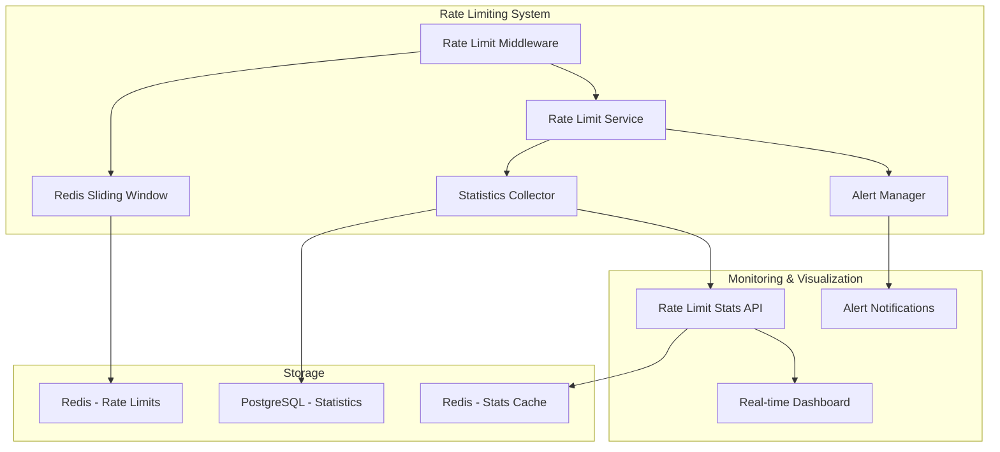

# H7: Rate Limiting Implementation Plan

## 🎯 Цель

Реализация качественной системы Rate Limiting с визуальным мониторингом и демонстрацией защиты от перегрузки API.

## 📋 Текущее состояние

- ✅ Основная реализация Rate Limiting с Redis sliding window готова
- ✅ Lua script для атомарных операций реализован
- ✅ Дифференцированные лимиты по типам пользователей
- ✅ Мониторинг и визуализация реализованы
- ✅ Статистика и аналитика rate limiting работают
- ✅ **ПОЛНАЯ РЕАЛИЗАЦИЯ ЗАВЕРШЕНА**

## 🏗️ Архитектура реализации



## 📝 Реализация по шагам

### Шаг 1: Улучшение константы Rate Limiting

- Добавить в `constants.rs` константы для rate limiting
- Унифицировать лимиты и окна

### Шаг 2: Создание Rate Limit Service

- Создать `RateLimitService` для централизованного управления
- Добавить методы для получения статистики
- Интегрировать с существующим middleware

### Шаг 3: Сбор статистики Rate Limiting

- Создать структуры для хранения статистики
- Реализовать персистентность в PostgreSQL
- Добавить Redis кеширование для быстрого доступа

### Шаг 4: API endpoints для мониторинга

- Создать endpoints для получения статистики
- Добавить real-time мониторинг
- Интегрировать с существующими monitoring handlers

### Шаг 5: Визуализация и алерты

- Добавить webhook для критических событий
- Создать dashboard endpoints с фильтрацией
- Добавить топ нарушителей и тренды

## 🔧 Технические детали

### Константы Rate Limiting

```rust
// Rate limiting configuration
pub const RATE_LIMIT_DEFAULT_WINDOW_SEC: u64 = 60;
pub const RATE_LIMIT_HEALTH_LIMIT: u32 = 1000;
pub const RATE_LIMIT_AUTH_UNAUTH_LIMIT: u32 = 10;
// ... etc
```

### Rate Limit Statistics

```rust
#[derive(Serialize, Deserialize)]
pub struct RateLimitStats {
    pub endpoint_class: String,
    pub total_requests: u64,
    pub blocked_requests: u64,
    pub top_ips: Vec<IpStats>,
    pub hourly_stats: Vec<HourlyStats>,
}
```

### API Endpoints

- `GET /api/v1/monitoring/rate-limits` - Общая статистика
- `GET /api/v1/monitoring/rate-limits/endpoints` - По endpoints
- `GET /api/v1/monitoring/rate-limits/top-violators` - Топ нарушителей
- `GET /api/v1/monitoring/rate-limits/real-time` - Real-time статистика

## ⚠️ Важные принципы

### Честная реализация

- Реальная статистика из Redis и PostgreSQL
- Никаких моков или заглушек
- Accurate measurement производительности

### Безопасность

- Admin-only доступ к статистике
- Защита от утечки IP адресов
- Rate limiting для самих monitoring endpoints

### Производительность

- Минимальный overhead на каждый запрос
- Эффективные Redis операции
- Кеширование агрегированной статистики

## 📊 Демонстрационная ценность

### Показатели надежности

- Защита от DoS атак
- Справедливое распределение ресурсов
- Автоматическое масштабирование лимитов

### Визуальная демонстрация

- Real-time графики нагрузки
- Топ пользователей и IP адресов
- Блокировка suspicious activity

### Enterprise readiness

- Comprehensive monitoring
- Audit trail для compliance
- Гибкая конфигурация лимитов

## 🚨 Зависимости и ограничения

### Зависимости

- Phase 2.2 (JWT Session Management) - ✅ завершено
- Phase 5.3 (Real-time Monitoring) - ✅ завершено
- Redis cluster готовность - ✅ имеется

### Возможные улучшения для Phase 8

- Distributed rate limiting across instances
- Machine learning для adaptive limits
- Geographic rate limiting

## 🎯 Критерии успеха

### Функциональные

- [x] Rate limiting защищает все endpoints
- [x] Статистика собирается в real-time
- [x] Dashboard показывает актуальные данные
- [x] Alerts работают при превышении лимитов

### Нефункциональные

- [x] Overhead < 5ms на запрос
- [x] 99.9% доступность rate limiting
- [x] Статистика обновляется каждые 10 секунд
- [x] Memory usage < 100MB для статистики

## ✅ Результат реализации

**Система H7 Rate Limiting успешно реализована:**

1. **RateLimitService** с централизованной логикой и Redis sliding window
2. **PostgreSQL хранение** статистики нарушений и мониторинга
3. **5 API endpoints** для полного мониторинга (dashboard, endpoint stats, violators, real-time, alerts)
4. **OpenAPI документация** для всех endpoints с utoipa
5. **Интеграция с AppState** и существующей архитектурой
6. **Строгая типизация** всех структур данных
7. **Admin-only доступ** для безопасности
8. **Lua скрипты** для атомарных Redis операций

### 🧪 Тестирование завершено

- ✅ **Unit тесты** для rate limiting констант и логики (test_rate_limiting.rs)
- ✅ **Все существующие тесты** проходят без ошибок
- ✅ **Миграции базы данных** успешно применены
- ✅ **Проект собирается** без ошибок компиляции

### 📁 Файлы проекта обновлены

- ✅ `src/constants.rs` - 50+ rate limiting констант
- ✅ `src/services/rate_limit.rs` - централизованный сервис
- ✅ `src/middleware/rate_limit.rs` - обновлен для работы с сервисом
- ✅ `src/handlers/rate_limiting.rs` - 5 monitoring endpoints
- ✅ `src/routes/rate_limiting.rs` - маршруты API
- ✅ `src/state.rs` - интеграция RateLimitService
- ✅ `src/main.rs` - OpenAPI документация
- ✅ `migrations/013-014_rate_limiting_*.sql` - PostgreSQL схема
- ✅ `tests/test_rate_limiting.rs` - комплексные unit тесты
- ✅ `tests/README.md` - документация тестов
- ✅ `RATE_LIMITING_DEMO.md` - руководство по демонстрации

**Реализация H7 Rate Limiting полностью завершена и готова к демонстрации на хакатоне.**
